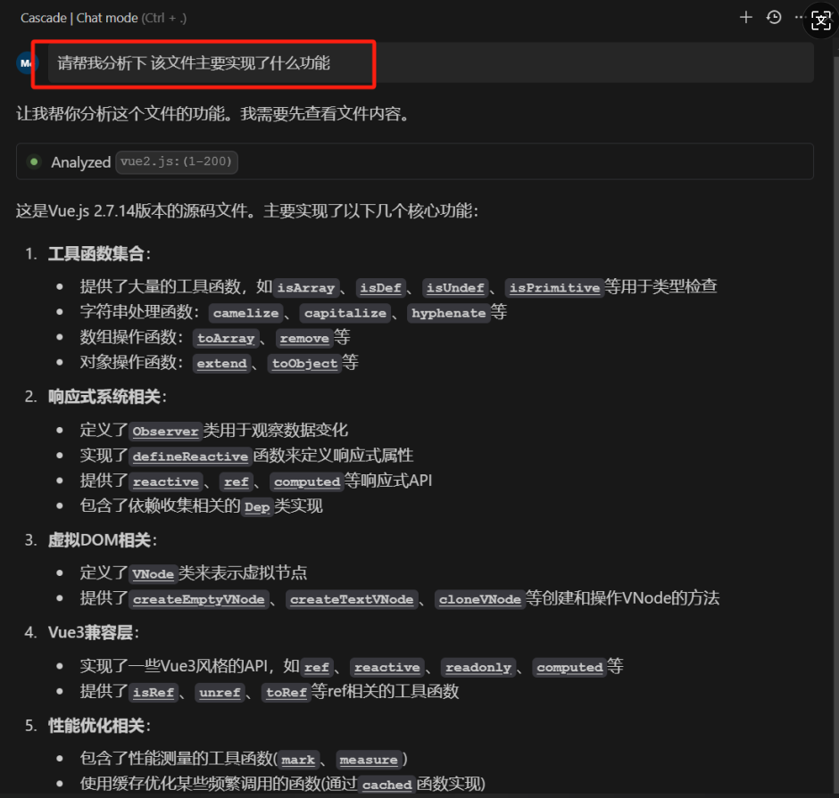
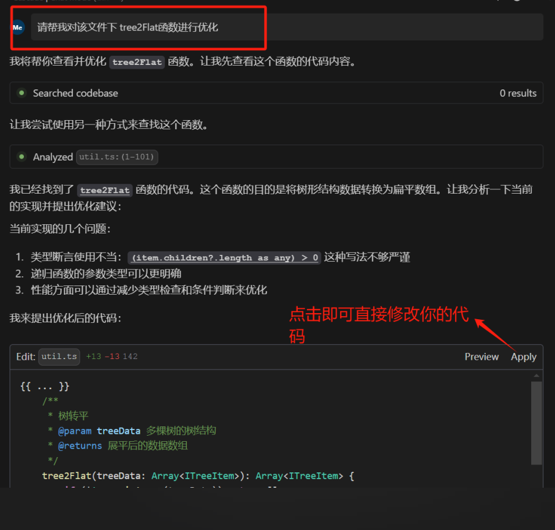
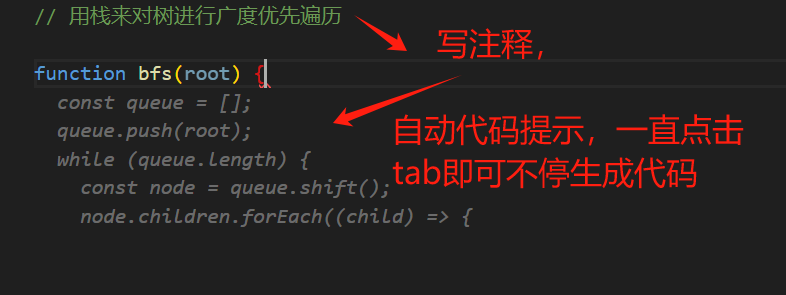
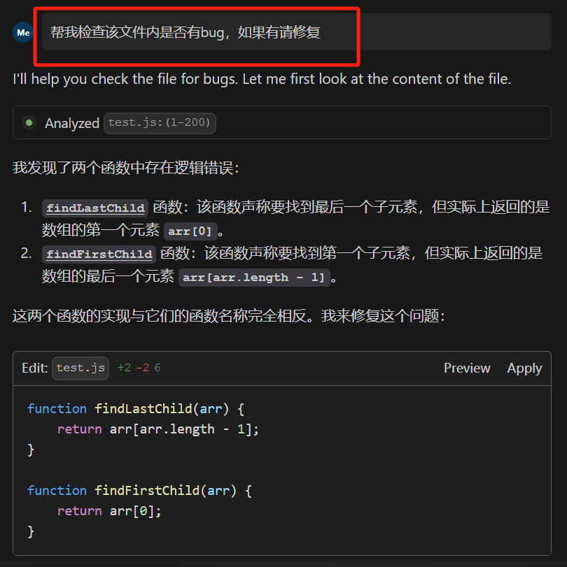
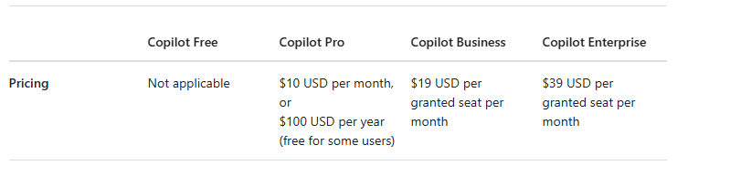

# 从前端视角探索AI世界

## 前言

本文旨在以前端开发的视角去探索AI的世界，主要围绕当下较火的一些国内外AI辅助开发工具进行探讨，让读者能够了解到目前的AI开发工具所具备哪些能力，我们又该如何利用他们去提高我们的开发效率

最后本文会对各大主流AI工具进行评测对比，如国外的**Copilot**,**Cursor**,**WindSurf**,国内的**通灵义码**等等，让感兴趣的朋友能够更快找到适合自己的AI

## AI在前端领域能做什么

### 1.代码分析

当我们阅读复杂业务代码或者三方源码时，AI能够起到很好的辅助作用，大的整个文件，小到某行代码，均可进行正确且完整的解析

### 2. 代码优化

在代码开发时，团队内可能因为技术水平，工作经历等缘故每个人开发出来的代码质量参差不齐，写完代码后，让AI帮忙优化，可以提升代码质量的下线

### 3. 代码提示

在我们写代码时，AI会阅读你写的代码，并且会根据你的上下文进行推导，来预测你想写代码，帮你减少工作量

### 4. Bug修复

当我们代码提测前，可以先由AI进行Bug检测，来有效减少Bug数量，当出现Bug时，AI也能帮忙修复Bug，当前案例较为简单，实际复杂业务代码中，AI也基本能胜任

## 市面上流行的AI辅助工具及优劣势对比

当前市面上可选择的AI工具有很多，如国内阿里的**通灵义码**，字节的**MarsCode**，百度的**文心快码**，国外github的**Copilot**，以及最近号称碾压Copilot的**Cursor**及**WindSurf**

博主在近一个月内，主要使用了以下几款AI工具进行日常开发，本文将从产品功能性、代码准确性、上手成本、产品公司实力以及性价比等方面进行对比

### 1. **Copilot**

**介绍**

Copilot是**GitHub**和**OpenAI**合作开发的一款人工智能代码助手，它可以根据用户输入的注释和代码片段，自动生成高质量的代码。Copilot使用了OpenAI的**GPT模型**，可以学习和理解大量的代码库和文档，从而生成符合用户需求的代码。

**核心功能**

   - **代码智能补充**
   - **AI智能问答**
   - **AI代码修改**

**AI载体**

主流编辑器插件，如VSCODE,IDEA等均有对应插件支持

**收费标准**

免费版：每个月有2000次代码智能补充，50次AI问答

个人版：每个月10美元，包年则为1年100美元

商务版：团队每个成员每月19美元

企业版：团队每个成员每月39美元

**优劣势**

优势：
- 微软，OpenAi大厂背书，未来发展有保障
- VSCode,Idea等主流编辑器良好插件支持
- 功能完善，模型先进
- 个人版费用相对适中

劣势：
- 国内用户使用速度相对较慢
- 团队使用费用较高
- 和后来的**Cursor**及**WindSurf**等工具比起来，功能相对较少

### 2. **Cursor**

**介绍**

Cursor是由美国企业**Anysphere**于2024年推出，该企业于2022年由麻省理工4位高材生联合成立，成立后的首款产品即为Cursor, Cursor刚一上线便有着赶超Copilot的势头，目前更是已经拥有了数十万稳定用户使用

**功能**

   - **独立AI编辑器**
   - **代码智能补充**
   - **AI实时问答，AI修改代码**
   - **Composer支持同一对话中同时修改多文件**
   - **Bug Finder支持一键在项目中扫描Bug**(试用阶段)

**AI载体**

自研独立编辑器，可以从VsCode快速迁移，同时也有VScode插件支持，不过没有编辑器功能强大

**收费标准**

免费版：每个月有2000次代码智能补充，2周Pro试用权限，50次慢问答

个人版：每个月20美元，无限制补充代码补充，500次快速问答，无限制的慢速问答

企业版：团队每个成员每月40美元

**优劣势**

优势：

- 功能相对于Copilot更加强大，有其特色的**Compose**,**Bug Finder**功能
- 独立编辑器的运行效率比Vscode更好
- 支持手动进行多文件上下文关联

劣势：

- 背后公司规模相对较小
- 个人版和企业版费用目前均为市场里最贵
- 使用Cursor编辑器需要短期的适应和过度
- 跨文件上下文依赖用户手动选择文件进行关联，有一定使用成本

### 3. **WindSurf**

**介绍**

WindSurf 是由 **Codeium**公司开发的一款新一代 **AI 集成开发环境（IDE）**，它把AI能力与IDE结合了起来。Codeium早在2021年便开始专注于人工智能领域，在该领域中有较大的影响力，WindSurf凭借其出色的跨文件上下文分析能力，刚一面世便得到广大开发者的喜爱

**功能**

   - **独立AI编辑器**
   - **代码智能补充**
   - **AI实时问答，AI修改代码**
   - **自动化跨文件分析上下文**

**AI载体**

在VsCode基础上进行优化开发的自研独立编辑器，界面和VsCode基本无差异，运行速度更快，暂无插件支持

**收费标准**

免费版：下载赠送50高级问答积分，200高级操作积分，无限制代码补充，每月5高级问答积分，5高级操作积分，无限制使用内置基础自研AI模式

个人版：早期注册者每月10美元，现在注册的每月15美元，500高级问答积分，1500高级操作积分，快速无限制使用内部基础AI模型

企业版：35美元/人 每月，每月每人300高级问答积分，1200高级操作积分，内部成员可共享积分，快速无限制使用内部基础AI模型

**优劣势**

优势：

- 具备**Cursor**的绝大部分功能
- 独有的**自动化分析项目上下文**，一切问答都基于整个项目，而非某些关联文件
- 编辑器基于Vscode优化开发，从Vscode过度流畅
- 目前国外主流AI工具中，其免费版是功能相对最为完善的

劣势：

- 只能使用WindSurf编辑器开发，目前暂无三方插件支持
- VsCode插件首次迁移后，后续的插件市场和Vscode不互通，并且插件未和账号关联，安装编辑器需要再次从Vscode同步
- 对于重度使用者来说，付费版用完当月积分后，需要继续付费购买额外积分

### 4. **通灵义码**

**介绍**

通灵义码是由**阿里**开发的一款基于**通义大模型**的 AI 研发辅助工具，提供代码智能生成、研发智能问答、多文件代码修改、自主执行等能力，为开发者带来智能化研发体验，引领 AI 原生研发新范式。

**功能**

   - **代码智能补充**
   - **AI实时问答，AI修改代码**
   - **快速生成注释，单例测试，代码优化**

**AI载体**

VsCode及IDE等主流编辑器插件

**收费标准**

完全免费

**优劣势**

优势：

- 背靠阿里大厂，研发投入稳定
- 完全免费，无任何费用
- VsCode,IDE均有插件支持
- 交互功能较为完善，其中可以局部生成代码注释，优化代码等
- 具备一定的跨文件上下文分析能力

劣势：

- AI引擎为**通义大模型**，和国际AI引擎**GPT 4o**,**Claude 3.5**相比较为稚嫩
- 生成代码准确性及质量相比于国外AI差距较明显，需要人工仔细二次矫正
- 上下文分析能力相对还较弱，需要语言引导
- 复杂场景下，AI计算效率相对较慢

## 总结

**Copilot**: 

主流编辑器内置插件，无编辑器上手成本，流畅使用的话，需要翻墙，背靠微软和OpenAi，研发迭代稳定，价格适中，代码准确性较高，跨文件分析能力一般

**Cursor**:

主推独立AI编辑器，也有部分市面编辑器的插件版本，但功能不如编辑器强大，初创公司背景，发展势头较大，每月价格较高，代码准确性高，跨文件关联分析能力较强

**WindSurf**:

只有独立AI编辑器，无插件支持，公司本身所有业务均为人工智能，相关领域经验丰富，AI模型成熟，免费版功能也较为全面，每月价高适中，跨文件上下文分析能力强

**通义灵码**：

国内头部AI编程工具，背靠阿里大厂，研发投入稳定，产品功能和交互设计完善，对于单一函数分析及优化能力较好，对于整体文件及跨文件分析能力较差，生成代码质量相对较差，需要人工二次检查，但是完全免费，性价比高

**个人前端用户使用，主推WindSurf**，免费版及个人版均可

**不想换编辑器，有翻墙软件，并且有一定预算的用户，推荐使用Copilot**

**预算有限，作为团队基础AI工具引入推荐通义灵码**
