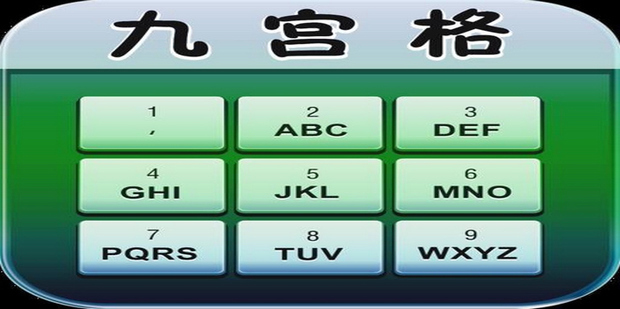

# 做过的算法题合集

## 1. 版本号排序

### 题目描述

给定一个版本号数组，按照版本号的大小进行排序。

### 示例

```javascript
const arr = ['0.3.2', '3.0.1', '2.0.3', '1.2.0', '2.1.2', '2.1.0', '0.2.1'];
console.log(sortArrByVersionId(arr));
// 输出: ['0.2.1', '0.3.2', '1.2.0', '2.0.3', '2.1.0', '2.1.2', '3.0.1']
```
### 答案

```javascript
function sortArrByVersionId(arr) {
	if (!Array.isArray(arr)|| arr?.length<=1) return arr;

	return arr.sort((a, b) => {
		const aArr = a.split('.').map(Number);
		const bArr = b.split('.').map(Number);
		for (let i = 0; i < 3; i++) {
			if (aArr[i] !== bArr[i]) {
				return aArr[i] - bArr[i];
			}
		}
		return 0;
	});
   
}
```

## 2.穷举拼音九宫格

### 题目描述


给定一个字符串（2-9），每个数组上面有对应字母（2->abc,3->def...），返回所有可能的拼音组合。

### 示例

```javascript
const str = '23';
console.log(logLetterByNumber(str));
// 输出: ['ad', 'ae', 'af', 'bd', 'be', 'bf', 'cd', 'ce', 'cf']
```
### 答案

```javascript
function logLetterByNumber(str){
    if(typeof str !=='string' || str?.length<1) return [];

    const letterMap = {
        2:['a','b','c'],
        3:['d','e','f'],
        4:['g','h','i'],
        5:['j','k','l'],
        6:['m','n','o'],
        7:['p','q','r','s'],
        8:['t','u','v'],
        9:['w','x','y','z']
    };

    const result = []

    const recurFunc = (cur,letters)=>{
        if(letters.length===0){
            result.push(cur);
            return 
        }
        const digits = letterMap[letters[0]];
        for (const letter of digits) {
            recurFunc(cur + letter, letters.slice(1));
        }
    }

    recurFunc('',str)

    return result
} 
```
## 3. 数组间取交集

### 题目描述

入参：二维数组，[[2,3,4],[3,4],[43,2,3,4]...]  出参:各个数组间的交集部分，[3,4];

### 示例

```javascript
const arr = [[2,3,4],[3,4,5],[4,5,6]];
console.log(getIntersection(arr));
// 输出: [4]
```
### 答案

```javascript
function getIntersection(arr){
    if(!Array.isArray(arr)||arr?.length<1) return[];

    const checkExist = item=>{
        return arr.slice(1).every(arrItem=>{
            return arrItem.includes(item)
        })
    }
    const result = []
    arr[0].forEach(item=>{
        if(checkExist(item)){
            result.push(item)
        }
        
    })

    return result
}
```

## 4. 两数之和

### 题目描述

给定一个整数数组 nums 和一个整数目标值 target，请你在该数组中找出 和为目标值 target  的那 两个 整数，并返回它们的数组下标。

你可以假设每种输入只会对应一个答案，并且你不能使用两次相同的元素。

你可以按任意顺序返回答案。

### 示例

输入：nums = [2,7,11,15], target = 9
输出：[0,1]
解释：因为 nums[0] + nums[1] == 9 ，返回 [0, 1] 。

### 答案

```js
function findTwoNumByTotal(arr,total){
    if(!Array.isArray(arr)||typeof total !=='number') return [];

    const map = new Map();
    for (let i = 0; i < arr.length; i++) {
        const item = arr[i];
        if(map.has(total-item)){
            return [map.get(total-item),i]
        }
        map.set(item,i)
    }
    
}
```
## 5. 回文数

### 题目描述

给你一个整数 x ，如果 x 是一个回文整数，返回 true ；否则，返回 false 。

回文数是指正序（从左向右）和倒序（从右向左）读都是一样的整数。

例如，121 是回文，而 123 不是。

### 示例

输入：x = 121
输出：true

输入：x = -121
输出：false
解释：从左向右读, 为 -121 。 从右向左读, 为 121- 。因此它不是一个回文数。

### 答案

```js

function isPalindrome (num){
    if(typeof num !=='number') return false;

    return num === Number(num.toString()?.split('').reverse().join(''));
}

```

## 6. 罗马数字

### 题目描述

罗马数字包含以下七种字符: I， V， X， L，C，D 和 M。

字符          数值
I             1
V             5
X             10
L             50
C             100
D             500
M             1000
例如， 罗马数字 2 写做 II ，即为两个并列的 1 。12 写做 XII ，即为 X + II 。 27 写做  XXVII, 即为 XX + V + II 。

通常情况下，罗马数字中小的数字在大的数字的右边。但也存在特例，例如 4 不写做 IIII，而是 IV。数字 1 在数字 5 的左边，所表示的数等于大数 5 减小数 1 得到的数值 4 。同样地，数字 9 表示为 IX。这个特殊的规则只适用于以下六种情况：

I 可以放在 V (5) 和 X (10) 的左边，来表示 4 和 9。
X 可以放在 L (50) 和 C (100) 的左边，来表示 40 和 90。 
C 可以放在 D (500) 和 M (1000) 的左边，来表示 400 和 900。
给定一个罗马数字，将其转换成整数。

### 示例

输入: s = "III"
输出: 3

输入: s = "IX"
输出: 9

### 答案

```js
function romanToInt(s) {
    if (typeof s !== 'string') return s;
    
    const romanMap = {
        'I': 1,
        'V': 5,
        'X': 10,
        'L': 50,
        'C': 100,
        'D': 500,
        'M': 1000
    };

    let result = 0;
    
    for (let i = 0; i < s.length; i++) {
        if (!romanMap[s[i]]) {
            console.error('入参不是合法的罗马数字');
            return s;
        }
        
        const curr = romanMap[s[i]];
        const next = romanMap[s[i + 1]] || 0;
        
        result += curr < next ? -curr : curr;
    }
    
    return result;
}
```

## 7. 最长公共前缀

### 题目描述

编写一个函数来查找字符串数组中的最长公共前缀。

如果不存在公共前缀，返回空字符串 ""。

### 示例

输入：strs = ["flower","flow","flight"]
输出："fl"

输入：strs = ["dog","racecar","car"]
输出：""
解释：输入不存在公共前缀。

### 答案

```js
function longestCommonPrefix(strs){
 if(!Array.isArray(strs)) return '';

  let result = strs[0];
  
  for (let i = 1; i < strs.length; i++) {
    const item = strs[i];
    for (let j = 0; j < result.length; j++) {
        const prev = result[j];
        const cur = item[j];
        if(prev!==cur){
            result = result.slice(0,j)
        }        
    }
  }

  return result;
}
```

## 8. 有效括号

### 题目描述

给定一个只包括 '('，')'，'{'，'}'，'['，']' 的字符串 s ，判断字符串是否有效。

有效字符串需满足：

左括号必须用相同类型的右括号闭合。
左括号必须以正确的顺序闭合。
每个右括号都有一个对应的相同类型的左括号。

### 示例

输入：s = "()"
输出：true

输入：s = "()[]{}"
输出：true

输入：s = "(]"
输出：false

### 答案

```js

const isValid = function (s) {
  if (typeof s !== "string") return false;
  if (s.length % 2 !== 0) return false;

  const validMap = {
    "(": ")",
    "[": "]",
    "{": "}",
  };
  const stack = [];

  for (let i = 0; i < s.length; i++) {
    const item = s[i];
    const lastItem = stack[stack.length - 1];

    if (lastItem && validMap[lastItem] === item) {
      stack.pop();
    } else {
      stack.push(item);
    }
  }

  return stack.length === 0;
};

```

## 9. 冒泡排序

### 题目描述

通过冒泡排序的思路，对无序数组进行排序

### 示例

输入：[2,1,3,55,21]   输出：[1,2,3,21,55]

### 答案

```js
function sortArr(arr) {
    if (!Array.isArray(arr)) return arr;
    const len = arr.length;
    
    for (let i = 0; i < len - 1; i++) {
        let swapped = false;
        // 注意这里的 len-i-1，因为后面i个元素已经排好序
        for (let j = 0; j < len - i - 1; j++) {
            if (arr[j] > arr[j + 1]) {
                [arr[j], arr[j + 1]] = [arr[j + 1], arr[j]];
                swapped = true;
            }
        }
        // 如果没有发生交换，说明数组已经有序
        if (!swapped) break;
    }
    
    return arr;
}
```