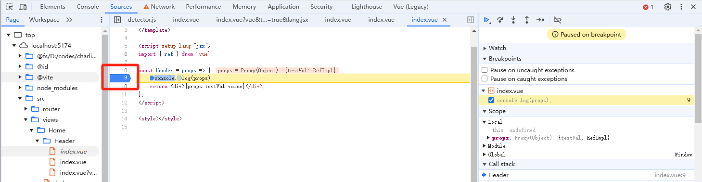
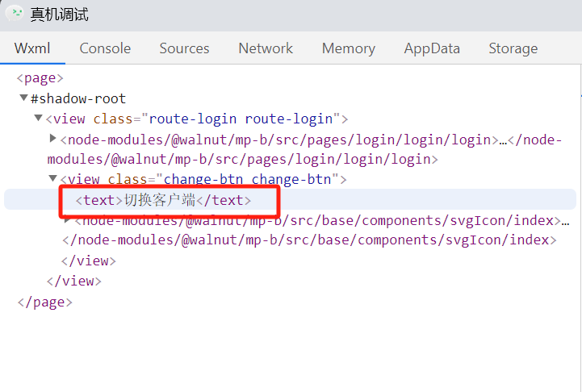

# 前端最全 debugger 技巧

## 浏览器开发者工具

浏览器开发者工具对于前端来说是使用最多的 Web 端 Debug 工具，其中开发者最为熟悉的为谷歌浏览器调试工具，除了谷歌外，别的浏览器或者一些 Webview 环境也提供了对应的开发者工具，功能大致相同，在此以谷歌浏览器（V131）作为 Demo 讲解

### Elements（元素）

Elements 主要用于对 Dom 树及 Css 样式表的页面调试

#### 基本功能

- 查看网页结构

  打开 Elements 标签后，你可以看到当前网页的 HTML 结构（DOM）。
  使用鼠标悬浮或点击 DOM 元素，网页上相应的部分会高亮显示。

- 查看和修改元素属性

  双击某个 HTML 标签，你可以编辑它的属性（如 id、class 等）。
  右键某个标签 → Edit as HTML，可以编辑整个标签的内容。

- 实时修改样式

  在右侧的 Styles 面板中，可以看到选中元素的 CSS 样式。
  点击样式规则旁边的值，可以直接修改，结果会实时反映在网页上。
  你可以添加新的样式规则，临时调试和测试布局效果。

- 检查元素的状态

  右键某个元素 → Force state，可以模拟元素的伪类状态，如 :hover、:focus、:active 等，方便调试动态样式。

#### 实用技巧

- 快速复制选择器

  当你使用三方组件，并且需要做样式覆盖时，可右键对应元素选中 copy=>copy selector 快速获取对应选择器

- 在 dom 中快速定位元素

  当 dom-tree 上元素特别多的时候，想快速定位元素可以在 element 中键入 ctrl+f 并且输入关键字，如 class、id、元素上的属性等，即可快速定位到对应元素

- 快速在 Styles 中定位生效样式

  当某个元素的 css 样式特别多时，在 Styles 中较难看出某个属性到底最终生效的是哪个选择器中的权重，我们可以通过 Styles 旁边的 Computed 页签来快速查看各个属性生效的值，hover 到对应数值上，点击左侧小按钮即可快速定位到 Styles 中该属性选择器生效的地方

  
  

### Console(控制台)

Console 标签提供了非常丰富的功能，除了简单的日志输出，还能帮助你测量性能、调试异步代码、跟踪函数调用等。掌握这些技巧，可以让你在开发过程中更加高效地调试和优化代码。

#### 常用输出方法

- console.log：开发时输出普通的日志信息，一般会在打包时去掉
- console.info：用于一些关键节点数据的控制台打印，用于线上问题排查
- console.error：一般用于异常捕获后在 catch 中用来打印报错内容
- console.warn：一般用于某些 sdk 的日志打印，尤其是一些降级逻辑的开启
- console.table：对数组和对象的输出，输出内容以表格展示，方便查看

  

- console.time：常用于函数计时的开始，用于测试复杂函数的执行性能
- console.timeEnd：函数计时的结束

  

- console.count: 常用于函数执行次数统计，每执行一次返回值则在当前作用域下+1

  

- console.countReset：搭配 count 使用，可以重置当前作用域下的 count 次数

- console.trace：打印当前输出被调用的完整调用栈，类似于 debugger 中的 call-stack

  

- console.group：和 console.groupEnd()搭配使用给 console 分组

  

- console.clear：清除所有 console 的记录

#### Console 中运行代码

在我们的 Console 控制台除了能够根据各种函数打印日志外，也能直接运行 JS 代码，在 debugger 下，作用域为当前 debugger 执行到的函数上下文作用域，非 debugger 中则为全局作用域


### Sources(源代码/来源)

Sources 标签主要用于调试和分析 JavaScript 代码，它提供了强大的功能，帮助开发人员查看和调试源码，其中 断点调试功能更是任何前端程序员都必须熟练掌握的技巧

#### 常见断点技巧

我们在开发过程中，常常需要使用到 debugger 功能，基于开发者工具，我们常用的 Debugger 功能包括：**代码断点**，**SourcePage 断点**, **网络断点**，**Dom 断点**,**事件断点**等

在通过以上几个技巧进入到断点后，我们可以通过开发者工具的来进行代码的步进，变量的监听，call-stack 的回溯等等手段来定位及修复疑难 bug


下面我们逐一讲解在不同场景下，我们该如何进入到断点调试中

- 代码断点

  代码断点是指，在我们的代码中，通过“debugger”关键字来进入断点，当开发者工具处于打开时，代码执行到 debugger 关键字时，则会自动进入到断点中
  

- SourcePage 断点

  当我们的静态资源打包部署到服务器后，用户输入对应域名后，浏览器会请求到对应资源进行解析用于页面的渲染和逻辑的执行，而所有静态资源都会在 Source 的 page 中显示，我们可以通过在对应 page 下找到你的代码，然后点击对应行，即可进行断点，该方法还可以搭配条件断点使用，在后续会详细讲解
  

- 网络断点

  我们有时可能会遇到某些接口请求不知道是在哪里调用的，代码里又有很多地方都用到了该接口，这个时候，我们就可以通过网络断点结合 call-stack 来找到接口调用处
  
  

- Dom 断点

  在 JQ 时代，前端研发都是通过操作 Dom 来改变视图，那个时候每个 dom 的新增，删除，修改都是人为控制的， 现在为了提升开发效率，各大前端框架均是以数据驱动视图作为核心，修改数据后，由 VM 进行视图的更新，当数据流较为复杂时，可能出现 Dom 的修改操作无很难进行溯源，而元素断点功能就可以轻松实现 Dom 操作溯源


- subtree modifications: 该节点的子节点变化时进入断点
- attribute modifications: 该节点的属性发生变化时进入断点
- node removal：该节点被移除时进入断点

进入断点后，我们根据对应的 call-stack 即可找到使 dom 变化的源头

- 事件断点

  事件断点一般用于快速定位某事件被触发的源头

  1. 首先在 Source Tab 下设置 Event listeners breakpoints
     
  2. 对应事件触发后，通过 call-stack 追溯到源码

#### 线上调试代码

- SourceMap

  - 问题：通常来说我们发到线上的静态资源为了减小包体积及防止源码泄露等问题，等会在发布前进行代码压缩和混淆，那么在可读性上会大打折扣，从而增加调试 bug 的难度
    

  - 方案：我们可以通过 Webpack 配置，来开启 SourceMap，本质上就是将源码保留并且和打包后的资源建立映射关系，在调试代码的时候，浏览器指向源码处，这样就能很轻松的进行调试了
  - 具体步骤：

    1. 更改 Webpack 配置文件

       ```js
       module.exports = {
       ...,
       // 开发环境生成SourceMap, 一般不推荐包体积会增大，且代码易泄露
       productionSourceMap: true,
       configureWebpack: {
       // 开发环境开启SourceMap
       devtool: 'source-map'
         },
       }
       ```

    2. 浏览器中开启 SourceMap 支持
       

- Search

Search 功能可以帮我们在当前本地及远程请求回来的所有资源中（静态和接口均可）搜索关键字来进行代码定位


按照上图步骤完成定位后，你可以通过 debugger(断点)或者 override(重写)的方式进行线上 bug 调试

- Override

Override 可以让我们在本地临时修改线上运行的代码来排查问题，具体的操作步骤如下：

1. 先通过上述 Search 的方法定位到目标代码及所在文件
2. 右键代码所在文件，点击 Override content
   
3. 选择本地映射的资源位置，随便指定一个文件夹即可
   
4. 允许 DevTools 的授权
   
5. 在线上代码上做编辑，编辑完成后刷新页面即可生效
   
6. 还原线上代码
   

### Network(网络)

Network 该栏主要是针对浏览器网络进程做的抓包工具，所有网络请求均会被捕获，并且能在该栏中查看及调试

#### 基本功能


#### 实用技巧

1. Curl

在联调过程中，后端研发经常会让前端将请求数据给他们，或者重新调请求，我们前端可以通过复制 Curl 给到后端，里面包含一切请求数据，并且后端可以直接在终端中执行 Curl 自己请求接口


2. Override

上文讲到我们可以在 Source 中对静态资源进行重写，在 network 中同样允许我们对接口资源进行重写，来达到 mock 数据的目的，比如将线上环境的数据拿到本地开发环境使用


3. 模拟请求失败场景

在我们日常开发中，可能有些时候需要模拟某个资源请求失败的场景，来做降级逻辑或异常兜底的开发


### Performance(性能)

该 Tab 主要用于性能优化时排查使用，详情请见博客中[前端性能优化](https://doggyegg.github.io/charlie-blog/front/base/performance/)

### Application(应用)

该栏主要展示某些存放在浏览器文件夹下的缓存文件数据，如 Cookie,LocalStorage,SessionStorage,IndexDB 等

通过修改本地储存中 Token 的值，我们可以模拟其它账号登录，用于接口的数据调试等功能的调试


## 三方框架插件

除了浏览器自带的开发者工具外，我们也可以通过一些 3 方框架配套的浏览器插件来进行调试，如 Vue-DevTool 及 React

### Vue-devTool

- [安装链接（需要翻墙）](https://chromewebstore.google.com/detail/vuejs-devtools/iaajmlceplecbljialhhkmedjlpdblhp)
- 安装完成后在开发环境如果是 Vue 项目即可使用该插件进行状态、Dom、等等的调试
  
- 默认情况下，只有在开发环境该插件才能正常加载使用，但是我们可以通过安装[Vue force dev](https://chromewebstore.google.com/detail/vue-force-dev/oohfffedbkbjnbpbbedapppafmlnccmb) 来实现生产环境使用 Vue-devtool 调试

### React

- [React Developer Tools 安装链接](https://chromewebstore.google.com/detail/react-developer-tools/fmkadmapgofadopljbjfkapdkoienihi)
- [LocatorJS-点击页面跳转到 vscode 源码处](https://chromewebstore.google.com/detail/locatorjs/npbfdllefekhdplbkdigpncggmojpefi)
  

## 移动端真机调试

常见的移动端应用一般分为 H5，小程序，APP 等，我们开发过程中通常会在电脑上使用模拟器如谷歌开发者工具模拟手机端，微信开发者工具真机预览模式，APP 一些三方真机模拟器（如逍遥模拟器），来简化移动端开发的难度，但是如果是真机上面，我们该如何调试呢？

### H5

H5 我们在此定义为通过手机浏览器或某些 APP 中内嵌的 Webview 环境下运行的前端页面

#### 逻辑层

在 PC 浏览器开发中，我们通常使用浏览器开发者工具（控制台）来进行调试，在手机上我们能否也使用控制台来进行调试呢？答案是可以的，我们可以通过引入 vConsole 找个三方库来实现真机上运行控制台

- 步骤：

1. 在入口页（index.html）通过 CDN 引入 XConsole 插件，并且实例化
   
2. 在真机上运行，点击 VConsole 即可打开控制台，通过日志来进行问题排查
   
   

#### 样式层

通过 VConsole 让我们可以在真机进行 JS 层面的调试，那么如何进行 Dom 及样式层面的调试呢？

我们在此使用谷歌浏览器的 google-inspect 实现该需求

- 步骤：

1. 手机连接数据线到电脑上
2. 打开手机开发者模式，不同手机开启的方式不同，一般都是在手机系统版本号处多次点击，具体自行百度
   
3. 开启开发者模式后，在手机设置中的开发者选项中打开 USB 调试
   
4. 在 PC 浏览器中访问 chrome://inspect/#devices，注意这里需要翻墙，访问后，你手机上访问的浏览器资源会在该页面显示，找到对应页面点击 inspect 即可映射资源到 PC 浏览器上进行调试


### 小程序

小程序本质上及为三方 APP 中内置的 Webview 环境，如微信小程序，虽然使用了双线程架构，本质上运行的环境还是 WebView,在此我们以微信小程序进行演示

#### 逻辑层

相比与 H5，小程序已经内置了自己的开发者工具供我们在真机上使用，只需要在手机小程序上开启即可


#### 样式层

在样式调试上，微信开发者工具也已经内置好了一套完善的模式-**真机调试**，我们可以直接在真机调试下进行 Dom 层的调试

- 步骤：

1. 电脑上打开微信开发者工具，点击真机调试，并且用手机扫描二维码
   
2. 扫描二维码后，电脑会自动打开真机调试界面，即可将真机映射到电脑上进行调试
   
   

### 抓包

我们的互联网在进行数据交互时，无论是获取静态资源如网页，图片，样式等，还是接口数据，本质上都是数据包的传递，而抓包指的就是在数据传递过程中，进行数据捕获，一般用于发生异常时，先排查是后端数据源的问题，还是前端展示的问题。

在 PC 端，我们通过浏览器开发者工具的 Network 去查看资源，本质上也是抓包，只是开发者工具已经帮我们简化了该功能，那么在真机上，我们如何进行抓包呢？

市面上有许多抓包工具供我们使用，如老牌的 Charles,Fiddler，以及国产开发的新锐 Whistle,大家可以自行选择，在此我们使用 Whistle 来进行演示

#### Whistle

[whistle 使用教程](https://blog.csdn.net/qq_42445025/article/details/121796927)
