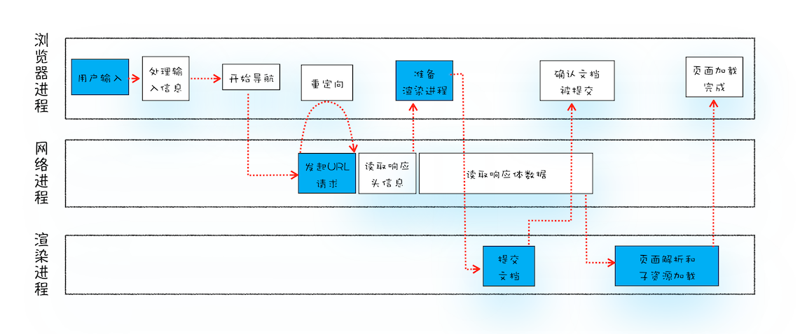
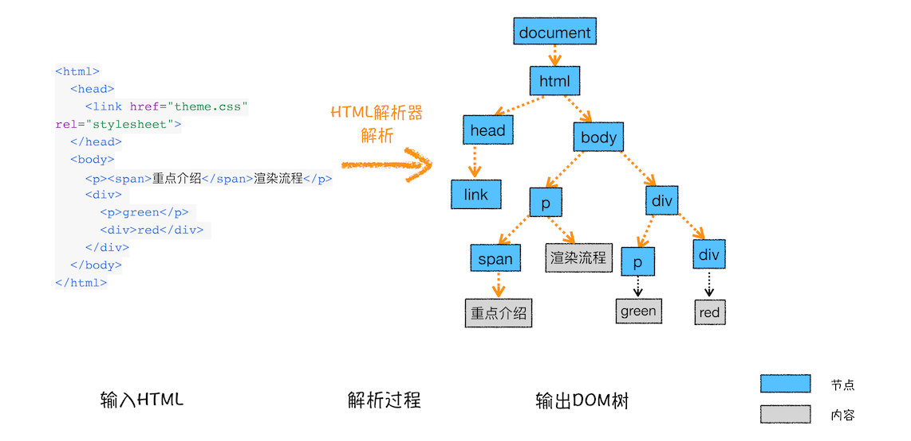
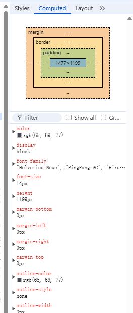
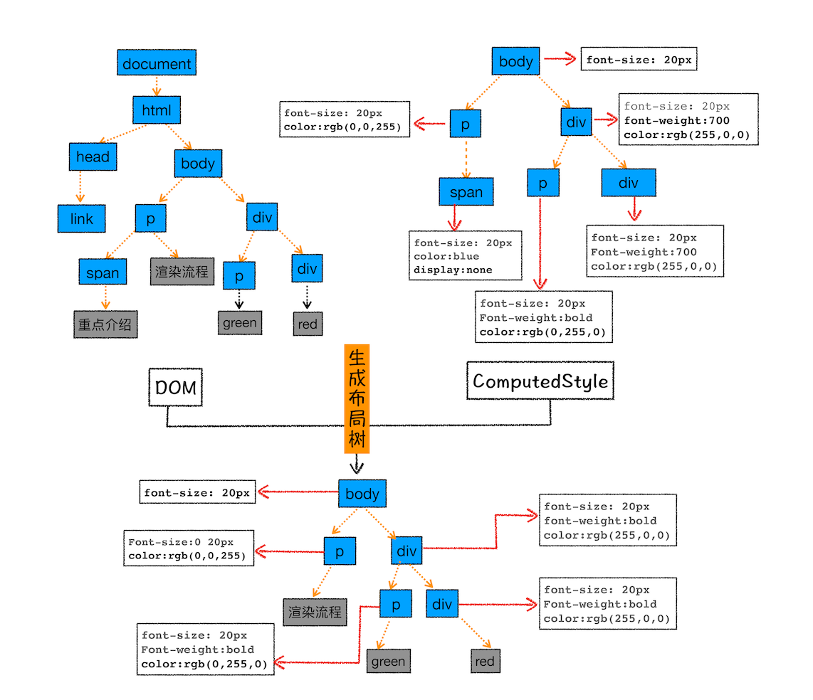
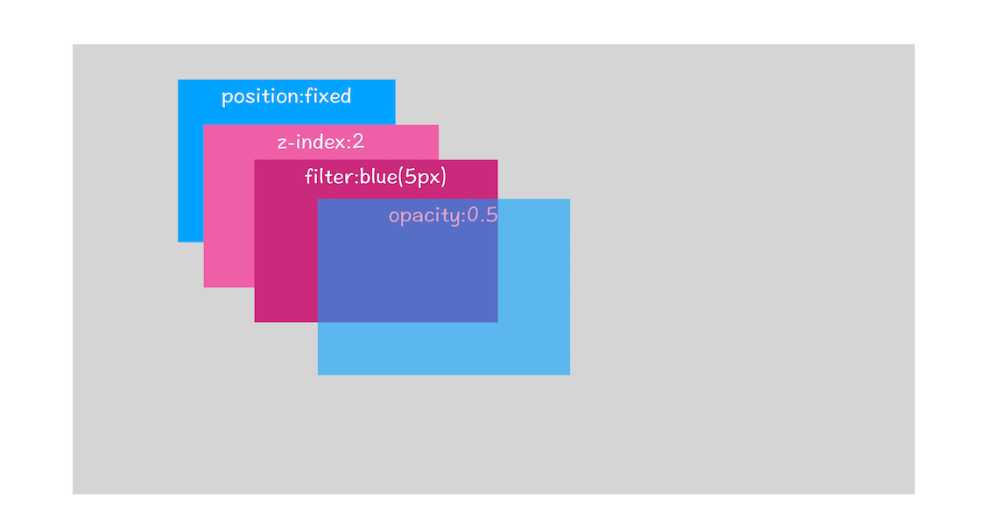
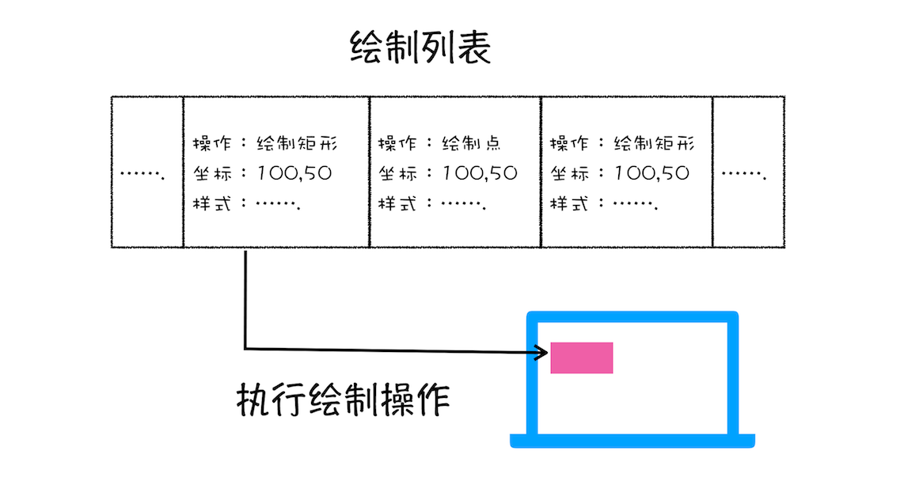
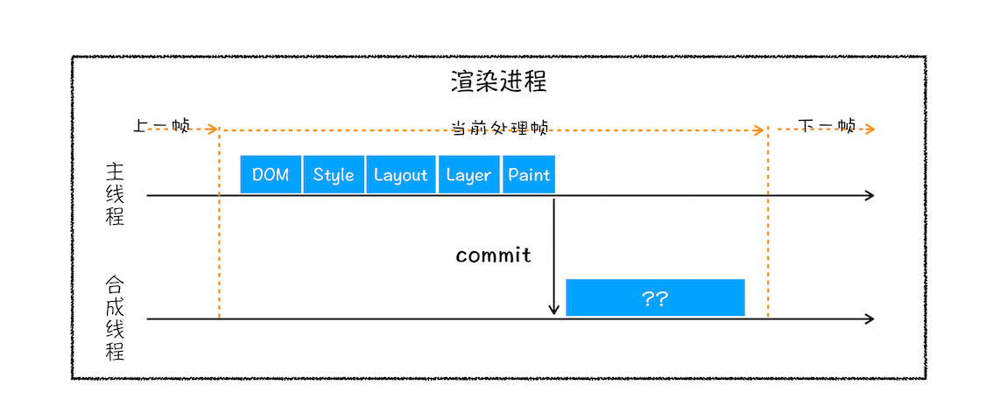
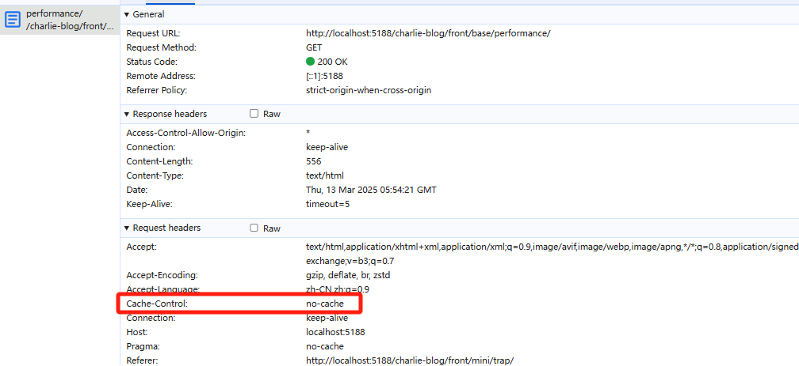
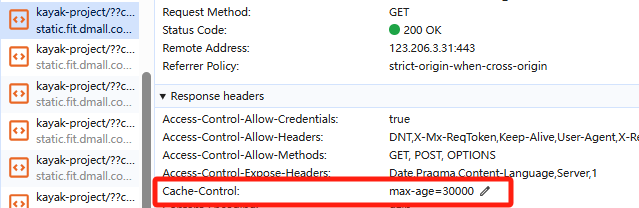
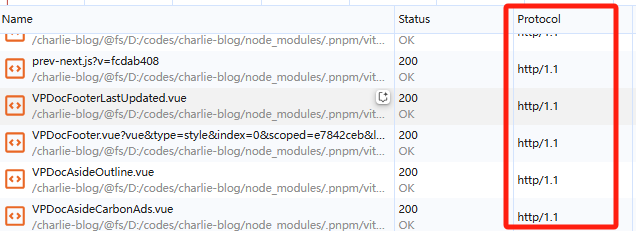

# 前端常见性能优化方案

## 从输入Url到出现可交互的页面

前端所说的性能优化，本质上就是指用户从输入页面路径到可交互页面出现的时间、以及用户在操作过程中的流畅度等，那么在聊性能优化前，我们得先知道这中间一共经历了哪些流程



### 1.用户输入

当用户在地址栏中输入一段内容后，浏览器会先判断该段内容是否符合协议规范，如果不符合，则会使用默认的搜索引擎，来合成新的带搜索关键字的 URL

如果判断输入内容符合 URL 规则，比如输入的是 doggyegg.github.io/charlie-blog/，那么地址栏会根据规则，把这段内容加上协议，合成为完整的 URL，如 https://doggyegg.github.io/charlie-blog/。

### 2.URL 请求过程

接下来，便进入了页面资源请求过程。这时，浏览器进程会通过进程间通信（IPC）把 URL 请求发送至网络进程，网络进程接收到 URL 请求后，会在这里发起真正的 URL 请求流程。那具体流程是怎样的呢？首先，网络进程会查找本地缓存是否缓存了该资源。如果有缓存资源，那么直接返回资源给浏览器进程；

#### 强缓存

强缓存是指浏览器直接从本地缓存中获取资源，而不需要向服务器发送请求。当浏览器第一次请求资源时，服务器会在响应头中添加相关字段，告诉浏览器该资源可以被缓存以及缓存的有效期。

强缓存主要通过以下两个 HTTP 响应头字段来控制：

- **Expires**：HTTP/1.0 的产物，指定资源的过期时间（GMT 格式的绝对时间）。当浏览器再次请求该资源时，如果本地时间小于 Expires 设定的过期时间，则直接使用缓存。
  
- **Cache-Control**：HTTP/1.1 的产物，比 Expires 更加灵活，优先级也更高。常用的值包括：
  - `max-age=<seconds>`：指定资源能够被缓存的最长时间（相对时间）
  - `no-cache`：强制走协商缓存
  - `no-store`：不使用任何缓存
  - `private`：仅客户端可以缓存
  - `public`：客户端和代理服务器都可以缓存

当强缓存命中时，浏览器会直接从本地加载资源，不会发送任何网络请求，在 Chrome 的 Network 面板中显示为 `(from disk cache)` 或 `(from memory cache)`。

#### 弱缓存

弱缓存（也称为协商缓存）是指浏览器需要向服务器发送请求来确认缓存是否有效。如果缓存有效，服务器会返回 304 状态码（Not Modified），告诉浏览器可以使用本地缓存；如果缓存无效，则返回 200 状态码和最新的资源内容。

弱缓存主要通过以下两对 HTTP 头信息来控制：

- **Last-Modified/If-Modified-Since**：
  - 服务器在首次响应时会在响应头中添加 `Last-Modified` 字段，标记资源的最后修改时间
  - 浏览器再次请求时，会在请求头中添加 `If-Modified-Since` 字段，值为上次收到的 `Last-Modified` 值
  - 服务器根据资源的最后修改时间与 `If-Modified-Since` 进行比较，决定是返回 304 还是 200

- **ETag/If-None-Match**：
  - 服务器在首次响应时会在响应头中添加 `ETag` 字段，它是资源内容的唯一标识符（通常是内容的哈希值）
  - 浏览器再次请求时，会在请求头中添加 `If-None-Match` 字段，值为上次收到的 `ETag` 值
  - 服务器根据当前资源生成的 ETag 与 `If-None-Match` 进行比较，决定是返回 304 还是 200

ETag 的优先级高于 Last-Modified，同时存在时会优先使用 ETag。

弱缓存虽然需要发送请求到服务器，但当缓存有效时，只会传输很少的数据量，因此也能显著提升页面性能。

#### 开始请求

如果在缓存中没有查找到资源，那么直接进入网络请求流程。这请求前的第一步是要进行 DNS 解析，以获取请求域名的服务器 IP 地址。如果请求协议是 HTTPS，那么还需要建立 TLS 连接。接下来就是利用 IP 地址通过3次握手和服务器建立 TCP 连接。连接建立之后，浏览器端会构建请求行、请求头等信息，并把和该域名相关的 Cookie 等数据附加到请求头中，然后向服务器发送构建的请求信息。服务器接收到请求信息后，会根据请求信息生成响应数据（包括响应行、响应头和响应体等信息），并发给网络进程。等网络进程接收了响应行和响应头之后，就开始解析响应头的内容了。

- **重定向**:在接收到服务器返回的响应头后，网络进程开始解析响应头，如果发现返回的状态码是 301 或者 302，那么说明服务器需要浏览器重定向到其他 URL。这时网络进程会从响应头的 Location 字段里面读取重定向的地址，然后再发起新的 HTTP 或者 HTTPS 请求，一切又重头开始了。
- **响应数据类型处理**: 浏览器会根据响应头中的**Content-type**来决定如何处理响应体中的内容，如text/html则当作html文档解析，application/octet-stream则按照下载处理等

### 3.准备渲染进程

默认情况下，Chrome 会为每个页面分配一个渲染进程，也就是说，每打开一个新页面就会配套创建一个新的渲染进程。每个渲染进程里包含了JS运行时及对应的HTML，CSS解析器等，但是，也有一些例外，在符合**同一站点**（由A页面打开B页面，且AB页面拥有相同的协议和根域名）的情况下，浏览器会让多个页面直接运行在同一个渲染进程中

### 4.提交文档

所谓提交文档，就是指浏览器进程将网络进程接收到的 HTML 数据提交给渲染进程，具体流程是这样的：

- 首先当浏览器进程接收到网络进程的响应头数据之后，便向渲染进程发起“提交文档”的消息；
- 渲染进程接收到“提交文档”的消息后，会和网络进程建立传输数据的“管道”；
- 等文档数据传输完成之后，渲染进程会返回“确认提交”的消息给浏览器进程；
- 浏览器进程在收到“确认提交”的消息后，会更新浏览器界面状态，包括了安全状态、地址栏的 URL、前进后退的历史状态，并更新 Web 页面

这也就解释了为什么在浏览器的地址栏里面输入了一个地址后，之前的页面没有立马消失，而是要加载一会儿才会更新页面。到这里，一个完整的导航流程就“走”完了，这之后就要进入渲染阶段了

### 5.渲染阶段

总的来说，渲染阶段会分为：：构建 DOM 树、样式计算、布局阶段、分层、绘制、分块、光栅化和合成

#### 构建Dom树



从图中可以看出，构建 DOM 树的输入内容是一个非常简单的 HTML 文件，然后经由 HTML 解析器解析，最终输出树状结构的 DOM，这个阶段就是把html格式的text文档，解析为了dom-tree，也就是开发者工具中，我们可以审阅到的由一个个dom节点组合起来的树形结构


#### 样式计算

样式计算的目的是为了计算出 DOM 节点中每个元素的具体样式，这个阶段大体可分为三步来完成。

1. 通过CSS解析器，把CSS文本文件转换为浏览器能够理解的结构-styleSheets
2. 转换样式表中的属性值，使其标准化，如rem,blue,bold等统一转为 px,rgb,font-weight:700
3. 按照CSS的继承规则及层叠规则，计算出 DOM 树中每个节点的具体样式，也就是我们开发者工具中element下computed中显示的内容



#### 布局阶段

现在，我们有 DOM 树和 DOM 树中元素的样式，但这还不足以显示页面，因为我们还不知道 DOM 元素的几何位置信息。那么接下来就需要计算出 DOM 树中可见元素的几何位置，我们把这个计算过程叫做布局。



1. 创建布局树：DOM 树还含有很多不可见的元素，比如 head 标签，还有使用了 display:none 属性的元素。所以在显示之前，我们还要额外地构建一棵只包含可见元素布局树。
2. 布局计算：根据每个节点的样式来进行位置计算，计算过程非常复杂，这里先跳过

#### 分层



在获得Dom树，styleSheet，并且计算出布局树后，浏览器还是无法开始绘制页面，因为页面中有很多复杂的效果，如一些复杂的 3D 变换、页面滚动，或者使用 z-indexing 做 z 轴排序等，为了更加方便地实现这些效果，渲染引擎还需要为特定的节点生成专用的图层，并生成一棵对应的图层树（LayerTree）。要想直观地理解什么是图层，你可以打开 Chrome 的“开发者工具”，选择“Layers”标签，就可以可视化页面的分层情况

通常情况下，并不是布局树的每个节点都包含一个图层，如果一个节点没有对应的层，那么这个节点就从属于父节点的图层

#### 计算绘制列表

在完成图层树的构建之后，渲染引擎会对图层树中的每个图层进行绘制，渲染引擎实现图层的绘制会把一个图层的绘制拆分成很多小的绘制指令，然后再把这些指令按照顺序组成一个待绘制列表，如下图所示：



从图中可以看出，绘制列表中的指令其实非常简单，就是让其执行一个简单的绘制操作，比如绘制粉色矩形或者黑色的线等。而绘制一个元素通常需要好几条绘制指令，因为每个元素的背景、前景、边框都需要单独的指令去绘制。所以在图层绘制阶段，输出的内容就是这些待绘制列表。

#### 栅格化

绘制列表只是用来记录绘制顺序和绘制指令的列表，而实际上绘制操作是由渲染引擎中的合成线程来完成的。你可以结合下图来看下渲染主线程和合成线程之间的关系：



通常一个页面可能很大，但是用户只能看到其中的一部分，我们把用户可以看到的这个部分叫做视口（viewport）。基于这个原因，合成线程会将图层划分为图块

合成线程会按照视口附近的图块来优先生成位图，实际生成位图的操作是由栅格化来执行的。所谓栅格化，是指将图块转换为位图。而图块是栅格化执行的最小单位。渲染进程维护了一个栅格化的线程池，所有的图块栅格化都是在线程池内执行的

通常，栅格化过程都会使用 GPU 来加速生成，使用 GPU 生成位图的过程叫快速栅格化，或者 GPU 栅格化，生成的位图被保存在 GPU 内存中。

#### 合成和显示

一旦所有图块都被光栅化，合成线程就会生成一个绘制图块的命令——“DrawQuad”，然后将该命令提交给浏览器进程。浏览器进程里面有一个叫 viz 的组件，用来接收合成线程发过来的 DrawQuad 命令，然后根据 DrawQuad 命令，将其页面内容绘制到内存中，最后再将内存显示在屏幕上。


### 小结

在我们了解了完整的从输入Url到页面渲染出来的全过程后，其实我们就有了性能优化的方向了，我们需要做的就是以下几点：

- 减少网络资源请求的次数和时间
- 减少资源的数量和大小
- 减少页面重新绘制的次数，及JS等相关会阻塞页面绘制的执行时间

## 网络

从上述，URL请求过程我们可以看出，想减少网络请求的时间，我们主要可以从以下几个方面入手：

### 1.缓存策略：

- 在NG服务器上配置合理的缓存机制，减少静态资源的反复请求
- 我们可以将所有的静态资源如JS,CSS等都设置为强缓存，过期时间可以设置为1年或者更长，这样可以充分利用浏览器的缓存机制
- 我们将入口页，也就是index.html文件设置为no-store，也就是不缓存，用户每次刷新页面即可获取最新资源
- 在项目重新打包上线时，通过修改index.html中引入资源的路径,比如后面加?时间戳，来实现，用户获取到最新的JS,CSS文件

```nginx
server {
    location = /index.html {
        add_header Cache-Control "no-store, no-cache, must-revalidate, max-age=0";
        add_header Pragma "no-cache";
        expires -1;
    }
    
    location ~* \.(js|css)$ {
        add_header Cache-Control "public, max-age=31536000, immutable";
        expires 1y;
    }
    
}

```




### 2.IP协议升级

- http1.0每次发送请求时，都会重新建立一个tcp连接，额外开销非常大
- http1.1在http1.0的基础上实现tcp长连接，同一个tcp连接可以同时发送多个http请求，浏览器为统一域名会建立6-8个TCP连接，来同时并行处理请求，但是由于服务器必须按照请求顺序返回响应，所以一个请求的延迟会阻塞后续所有请求，从而造成队头阻塞问题
- http2.0采用一个TCP连接处理同一域名下所有请求，大大减少建立连接浪费的时间，并且采用多路复用，每个请求和响应分配唯一的流ID，解决了队头阻塞问题
- 当你的网站是单个资源较小，但是资源数量特别多的时候，从http1.1升级到2.0性能会有质的提升
- 我们可以在NG服务器上将非http2的协议都升级到http2.0
  
```nginx
server {
    listen 443 ssl http2;
    server_name example.com;
    
    ssl_certificate /path/to/certificate.crt;
    ssl_certificate_key /path/to/private.key;
    
    # 其他SSL配置...
}
```



### 3.利用CDN加速静态资源

- 原理：
  - 用户访问网站时，DNS将请求引导至最近的CDN节点
  - CDN节点检查是否有缓存资源，有则直接返回
  - 若无缓存，则向源服务器请求资源，获取后缓存并返回给用户
  - 后续用户访问同一资源时可直接从CDN节点获取
- 将项目静态资源，如各类图片，ICON，三方JS库等等放到CDN服务器可以大大提升静态资源的访问速度

## 包体积

如果说网络层面的优化是为了加速资源的请求效率，那么包体积的优化就是为了减少资源的大小，我们将从资源压缩，资源分包，无用资源优化等角度进行讲解

### GZIP压缩

- GZIP：

1. 什么是Gzip

   - Gzip是一种用于HTTP内容压缩的文件格式和压缩算法
   - 可以将文件大小减少70-90%
   - 特别适合压缩文本类文件(HTML、CSS、JavaScript等)
   - 支持的文件格式包括.gz、.tar.gz、.tgz等
2. Gzip原理
   
   - 服务器端：将数据进行压缩后再传输
   - 客户端：接收到压缩数据后进行解压
   - 属于HTTP压缩的一种实现方式(另一种常见的是deflate)

   1. Webpack配置生成Gzip文件
   
   ```js
    const CompressionPlugin = require("compression-webpack-plugin");

    module.exports = {
     plugins: [
     new CompressionPlugin({
      algorithm: 'gzip', // 使用gzip压缩
      test: /\.(js|css|html|svg)$/, // 压缩这些类型的文件
      threshold: 10240, // 只压缩大于10kb的文件
      minRatio: 0.8 // 只有压缩率小于这个值的资源才会被处理
    })
    ]
    }

    ```

     2. Vite配置生成Gzip文件

  ```js
   import viteCompression from 'vite-plugin-compression'

   export default {
    plugins: [
    viteCompression({
      verbose: true, // 是否在控制台输出压缩结果
      disable: false, // 是否禁用
      threshold: 10240, // 体积大于阈值时才会被压缩，单位b，默认1025
      algorithm: 'gzip', // 压缩算法，可选['gzip'，'brotliCompress'，'deflate'，'deflateRaw']
      ext: '.gz', // 生成的压缩包后缀
      deleteOriginFile: false // 是否删除原文件
     })
    ]
  }
  ```
   3. ng上配置开启GZIP
```nginx
server {
    # ... other configurations ...

    gzip on;
    gzip_comp_level 6;  # Compression level (1-9)
    gzip_min_length 1000;  # Minimum length to trigger compression
    gzip_types
        text/plain
        text/css
        text/javascript
        application/javascript
        application/json
        application/x-javascript
        application/xml
        application/xml+rss
        application/vnd.ms-fontobject
        application/x-font-ttf
        application/x-font-opentype
        application/x-font-truetype
        image/svg+xml
        image/x-icon
        font/opentype;
    gzip_proxied no-cache no-store private expired auth;
    gzip_vary on;  # Adds "Vary: Accept-Encoding" response header
    gzip_disable "MSIE [1-6]\.";  # Disable gzip for old IE versions
}
```

#### 代码混淆

代码混淆是前端性能优化和代码保护的重要手段。它通过将代码转换成功能上等价但难以理解和逆向工程的形式来实现。

 1. 混淆的主要方式

- **变量和函数名混淆**: 将有意义的标识符替换为简短的字母或数字组合
  ```js
  // 混淆前
  function calculateTotal(price, quantity) {
    return price * quantity;
  }
  
  // 混淆后
  function a(b,c){return b*c}
  ```

- **字符串混淆**: 对字符串常量进行编码或加密
- **控制流扁平化**: 重构代码的执行路径，使逻辑流程更难理解
- **死代码注入**: 插入永远不会执行的代码干扰分析
- **调试信息删除**: 移除源码映射、注释等调试相关信息

 2. 常用工具

- **Terser**: webpack v4以上版本的默认压缩工具
- **uglify-js**: 经典的JavaScript混淆和压缩工具
- **javascript-obfuscator**: 功能强大的JavaScript混淆器

 3. webpack配置示例

```js
const TerserPlugin = require('terser-webpack-plugin');

module.exports = {
  optimization: {
    minimize: true,
    minimizer: [
      new TerserPlugin({
        terserOptions: {
          compress: {
            drop_console: true,  // 移除console
            drop_debugger: true  // 移除debugger
          },
          mangle: true,         // 启用变量名混淆
          output: {
            comments: false     // 移除注释
          }
        }
      })
    ]
  }
};
```

 4. Vite配置示例

Vite在生产环境下默认使用Rollup构建，可以通过`build.minify`和`build.terserOptions`配置代码混淆：

```js
// vite.config.js
export default defineConfig({
  build: {
    minify: 'terser',  // 使用terser进行混淆（默认为esbuild）
    terserOptions: {
      compress: {
        drop_console: true,      // 移除console
        drop_debugger: true,     // 移除debugger
        pure_funcs: ['console.log'] // 移除指定函数
      },
      mangle: {
        toplevel: true,          // 混淆顶级作用域的变量
        safari10: true           // 兼容safari10
      },
      format: {
        comments: false          // 移除注释
      }
    }
  }
})
```

如果使用esbuild（Vite默认），配置方式如下：

```js
// vite.config.js
export default defineConfig({
  build: {
    minify: 'esbuild',
    target: 'es2015',
    terserOptions: undefined,    // 使用esbuild时需要移除terserOptions
    rollupOptions: {
      output: {
        manualChunks: undefined  // 可选：配置代码分割策略
      }
    }
  },
  esbuild: {
    drop: ['console', 'debugger'], // 移除console和debugger
    minify: true,                  // 启用压缩
    pure: ['console.log'],         // 移除指定函数调用
    legalComments: 'none'          // 移除注释
  }
})
```

两种方案对比：
- Terser：功能更丰富，混淆效果更好，但构建速度较慢
- ESBuild：构建速度极快，但混淆选项相对较少

5. 注意事项

- 保留必要的变量名（如API接口名）
- 合理配置sourcemap用于线上调试
- 评估混淆带来的性能开销
- 某些特殊场景（如eval）可能与混淆产生冲突

### 分包

分包（Code Splitting）是前端性能优化中的重要策略，通过将代码分割成多个较小的包，首屏只加载需要的资源、其它资源按需加载，我们熟知的路由懒以及小程序的主包子包加载其实本质上就是分包

#### 1. 分包的主要方式

- **入口点分割**: 通过配置多个入口来手动分割代码
- **动态导入**: 使用`import()`语法实现按需加载
- **公共依赖提取**: 将多个入口共用的依赖提取到单独的包中
- **按路由分割**: 将不同路由的代码分割成独立的包

#### 2. webpack分包配置

```js
// webpack.config.js
module.exports = {
  entry: {
    main: './src/main.js',
    admin: './src/admin.js'
  },
  optimization: {
    splitChunks: {
      chunks: 'all',      // 对所有chunk做分割
      minSize: 20000,     // 生成chunk的最小大小
      maxSize: 0,         // chunk的最大大小，0为不限制
      minChunks: 1,       // 最少被引用次数
      maxAsyncRequests: 30,  // 按需加载时的最大并行请求数
      maxInitialRequests: 30, // 入口点的最大并行请求数
      cacheGroups: {
        defaultVendors: {  // 第三方库分包配置
          test: /[\\/]node_modules[\\/]/,
          priority: -10,
          reuseExistingChunk: true,
          name: 'vendors'
        },
        default: {         // 默认分包配置
          minChunks: 2,
          priority: -20,
          reuseExistingChunk: true
        }
      }
    }
  }
};
```

#### 3. Vite分包配置

```js
// vite.config.js
export default defineConfig({
  build: {
    rollupOptions: {
      input: {
        main: resolve(__dirname, 'index.html'),
        admin: resolve(__dirname, 'admin.html')
      },
      output: {
        manualChunks: {
          // 将React相关库打包到一起
          'react-vendor': ['react', 'react-dom'],
          // 将所有node_modules下的模块打包到一起
          'vendor': (id) => {
            if (id.includes('node_modules')) {
              return 'vendor'
            }
          }
        }
      }
    }
  }
})
```

#### 4. 动态导入示例

```js
// React组件动态导入
const AdminPanel = React.lazy(() => import('./AdminPanel'));

// Vue组件动态导入
const AdminPanel = () => import('./AdminPanel.vue')

// 普通模块动态导入
button.addEventListener('click', async () => {
  const { default: module } = await import('./heavy-module.js');
  module.doSomething();
});
```

#### 5. 最佳实践

- **合理的分包粒度**: 太小的包会增加HTTP请求数，太大的包会影响加载速度
- **预加载关键路径**: 使用`<link rel="preload">`预加载重要资源
- **延迟加载非关键资源**: 使用`import()`实现按需加载
- **分析包大小**: 使用工具（如webpack-bundle-analyzer）分析并优化包大小
- **缓存策略**: 合理配置长期缓存，利用contenthash
- **并行加载**: 控制并行请求数，避免资源竞争

### Tree Shaking

Tree Shaking（摇树优化）是一种通过清除未使用代码（dead code）来优化打包结果的技术，它依赖于ES Module的静态结构特性。

#### 1. 工作原理

- **静态分析**: 基于ES Module的静态导入导出语法进行分析
- **副作用判断**: 识别模块的副作用，决定是否可以安全移除
- **依赖追踪**: 从入口文件开始，构建依赖树并标记使用的导出
- **死代码消除**: 在最终打包时移除未使用的导出

#### 2. webpack配置

```js
// webpack.config.js
module.exports = {
  mode: 'production',  // 生产模式默认启用 Tree Shaking
  optimization: {
    usedExports: true,    // 标记未使用的导出
    minimize: true,       // 启用代码压缩
    concatenateModules: true,  // 模块合并，提升Tree Shaking效果
    sideEffects: true    // 启用副作用分析
  }
}
```

package.json配置：
```json
{
  "name": "my-project",
  "sideEffects": [
    "*.css",
    "*.scss",
    "./src/some-side-effect-file.js"
  ]
}
```

#### 3. Vite配置

```js
// vite.config.js
export default defineConfig({
  build: {
    rollupOptions: {
      treeshake: {
        moduleSideEffects: false,  // 所有模块都没有副作用
        propertyReadSideEffects: false,  // 属性读取没有副作用
        tryCatchDeoptimization: false    // 优化try-catch块
      }
    }
  },
  esbuild: {
    treeShaking: true  // 启用esbuild的tree shaking
  }
})
```

#### 4. 编写支持Tree Shaking的代码

```js
// 好的写法 - 命名导出
export const add = (a, b) => a + b;
export const subtract = (a, b) => a - b;

// 不好的写法 - 默认导出对象
export default {
  add: (a, b) => a + b,
  subtract: (a, b) => a - b
};

// 好的写法 - 按需导入
import { Button } from 'antd';

// 不好的写法 - 导入整个库
import antd from 'antd';
```

#### 5. 常见问题和解决方案

- **babel配置问题**
```js
// .babelrc
{
  "presets": [
    ["@babel/preset-env", {
      "modules": false  // 保留ES模块语法，不转换为CommonJS
    }]
  ]
}
```

- **第三方库优化**
```js
// 使用支持Tree Shaking的版本
import { merge } from 'lodash-es';  // 而不是 import { merge } from 'lodash'

// 使用babel-plugin-import实现按需加载
{
  "plugins": [
    ["import", { 
      "libraryName": "antd",
      "style": "css"
    }]
  ]
}
```

## 页面渲染

在优化完网络和包体积后，接下来需要优化的就是浏览器接受到资源后的渲染过程，根据前面讲过的浏览器的渲染流水线，我们大概了解了浏览器从解析html,css,js等静态资源生成位图的过程，那在这个过程中，我们能做的优化主要是以下几点：

### 提升渲染效率

- 优先渲染视口内的内容
  - **路由懒加载** - 前文已经提到
  - **图片/视频懒加载**：图片src先为空，实际请求路径放到data-src，判断图片出现在视口，将data-src赋值给src, 判断视口可以使用IntersectionObserver
  - **虚拟滚动**：类似表格的分页加载，将大量数据进行分布渲染，根据滚动条通过绝对定位的top,或者translateY来无限滚动，通过滚动条的位置计算当前需要渲染的数据的下标，保证dom层上面同时只有视口内的数据挂载
- 尽量减少JS文件阻塞页面渲染
  - 后置加载js文件，将js文件资源引入放到body之后，或者使用defer属性
  - 复杂JS计算逻辑放到web-worker里进行，如大文件分片上传等等
  - 尽量减少JS对Dom的操作频率，如react/vue的虚拟dom和diff算法
  - 参考React-fiber架构思路，js执行为渲染让步
- 减少浏览器重绘，重排的频率
  - 重绘不一定重排，重排一定会重绘
  - 不影响布局位置的，不会重排
  - 使用 DocumentFragment 进行批量 DOM 修改，减少页面重排次数
  - 缓存会触发重排的属性值(如 offsetTop、clientWidth)，避免频繁读取
  - 使用 CSS class 替代多个 style 内联样式操作
  - 使用 position: absolute/fixed 让元素脱离文档流，减少对其他元素的影响
  - 使用 transform 替代 top/left 进行位置移动，因为 transform 不会触发重排
  - 使用 opacity 替代 visibility，因为 opacity 只会触发重绘
  - 避免使用 table 布局，table 中任何改动都会导致整个表格重新布局，考虑使用canvas绘制表格
  - 优先使用 flex/grid 这样的现代布局方案

### SSR（服务端渲染）

其实在前后端分离前，我们一直使用的就是SSR渲染，SSR渲染的本质就是所有的静态页面和动态数据（接口请求的数据）都在服务器上拼好，前端拿到的就是一个html文件，和传统的前后端分离项目比起来，节省了额外的接口请求时间以及请求过程中，数据变化导致浏览器反复重绘重排的时间

#### 1. SSR的优势

- **更快的首屏加载**：用户无需等待JavaScript bundle下载和执行就能看到页面内容
- **更好的SEO**：搜索引擎可以直接爬取完整的HTML内容
- **更好的性能体验**：特别是在低性能设备和弱网环境下

#### 2. SSR的实现方案

- **传统SSR**：
  - 服务端直接输出HTML
  - 适用于内容密集型网站
  - 代表框架：PHP、Java模板引擎等

- **同构SSR**：
  - 一套代码同时运行在服务端和客户端
  - 结合了SSR的优势和SPA的交互体验
  - 代表框架：Next.js、Nuxt.js、Remix等

#### 3. SSR性能优化要点

- **服务端优化**：
  - 使用缓存策略（页面缓存、组件缓存）
  - 数据预取优化
  - 采用流式渲染(Streaming SSR)
  - 合理使用服务端组件

- **客户端优化**：
  - 合理的hydration策略
  - 选择性hydration
  - 代码分割和懒加载
  - 预加载关键资源

#### 4. SSR的成本和考虑因素

- **服务器资源消耗**：需要更多的服务器资源
- **开发复杂度**：需要考虑同构环境的差异
- **缓存策略**：需要合理设计缓存方案
- **部署难度**：需要合适的部署和运维方案


