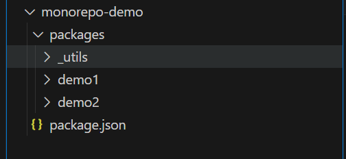
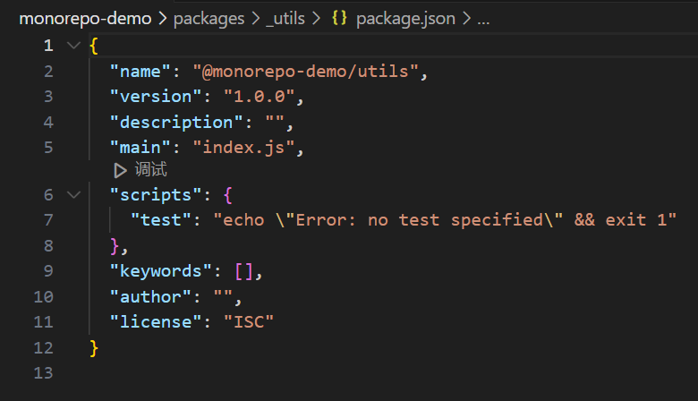
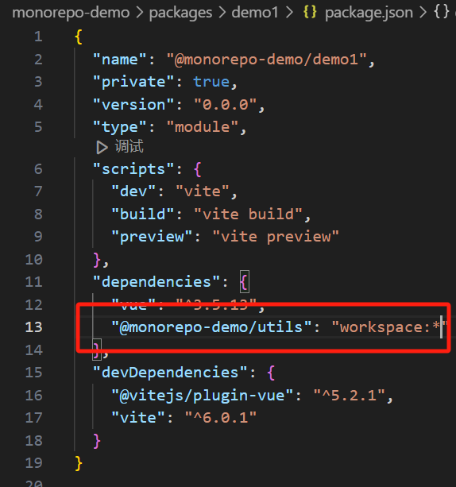
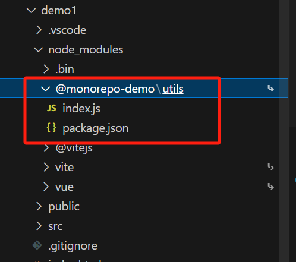
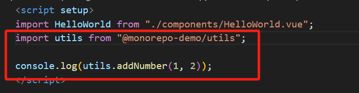
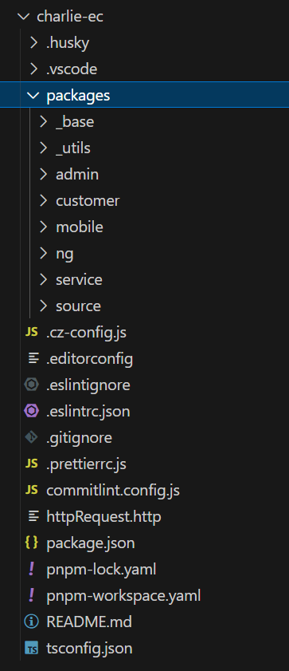

# Monorepo 理论与实践

## 什么是 Monorepo

Monorepo（单仓多包）是一种仓库管理模式，指的是将多个项目的代码存储在同一个版本控制仓库中，而不是将每个项目分成单独的仓库。它是一种代码管理策略，特别适用于大型项目或有多个子项目需要共享代码的情况

## Monorepo 的优劣势

### 优点

- **可复用性**：仓库内各子项目间代码共享和复用，如公共函数、公共组件、三方依赖包等等，同时各个子项目又能作为单独的发包和部署单位
- **一致性**：开发工具、配置和依赖版本在所有项目中保持一致，降低管理复杂性。简化依赖管理：通过工具（如 Yarn Workspaces 或 PNPM Workspaces）统一管理依赖，减少版本冲突。
- **原子性**：可以同时更新多个项目中的相关代码，确保功能改动的同步性。
- **可管理性**：公共包和对应业务域下的子项目在一个仓库中，组内授权，代码 MR、CR 等更为方便，查看代码历史提交记录也更为直观

### 缺点

- **仓库大**：随着项目迭代，仓库内容会越来越多，体积会越来越大，后续代码克隆耗时增加
- **权限颗粒度**：因为是单一仓库，所以权限为单一权限，当多团队协作时，较难根据团队来分配仓库权限
- **组件跨仓库**：如果后续涉及到跨代码仓库的项目间的公共组件、函数复用，迁移成本相对较高

## Monorepo 适用于哪些场景

根据上述优劣势的分析来看，不是所有时候 Monorepo 都是最好的选择，我们应该根据项目的实际情况来选择对应的方案，那么 Monorepo 适用于哪些场景呢？

### 适用

- 前端组件库项目，公共组件包、业务组件包、测试项目包等均可一起管理，项目复用
- 同业务域下多个相似业务项目，当某个业务域下有多个相似（UI 界面、交互）的项目时，可以通过 Monorepo 的管理方式以 workspace 协议相互引用实现公共组件和页面间的复用
- 小规模团队同时维护多个相同技术栈的业务项目，可以以 Monorepo 的管理方式进行代码复用，避免了通过 npm 包管理的发包，版本管理等繁琐流程

### 不适用

- 项目体积庞大，且各个子项目之间技术栈各不相同，如微前端架构下的各个技术栈不同的子项目
- 项目涉及到多团队甚至跨部门的人员，需要区分不同仓库权限

## 从 0 到 1 去构建一个 monorepo 项目

1. **确定包管理工具**：如 Pnpm 或 Yarn+Lerna,由于 Pnpm 天然支持 workspace 协议，本 demo 以 pnpm 作为包管理工具
2. **初始化根项目**：

```
mkdir monorepo-demo
cd monorepo-demo

pnpm init

```

3. **声明 workspace 协议作用范围**：在根目录创建 pnpm-workspace.yaml,并在其中声明子项目包的位置

```
packages:
  - "packages/*"
```

4. **创建 packages 文件夹用于存放各个子项目**



5. **初始化各个子项目**

各个子项目执行 pnpm init,并且修改对应 name 名


6. **根据引用关系添加 dependence**

   1. 
   2. pnpm i 安装依赖
   3. 在 demo1 子项目的 node-modules 中生成了对应子包即为成功
      

7. 在 demo1 中使用 utils 子包的资源
   
8. 目前一个 monorepo 架构的仓库已经搭建完成，子项目间可通过 workspace 协议进行资源互相引用，另外，可以在根项目中做好 eslint,cz,prettier 等公共配置，可统一作用于各个子项目，让项目更加规范，具体配置可以参考博客中[前端规范化](https://doggyegg.github.io/charlie-blog/front/engi/rule/)，最终一个完整的项目结构如下：



1. 示例项目链接：<https://github.com/doggyegg/charlie-ec>
