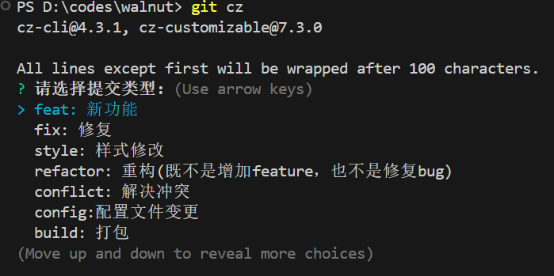

# 前端项目规范化

## 为什么需要前端规范化

从前后端分离后，前端的项目职责也变得和以前大不相同，从 HTML、CSS、JS 三剑客时代，过度到 JQ,BS 时代直到现在的各大框架百花齐放，这些使得前端工程变得愈加复杂

当多人协作开发时，项目的规范化就显得及其重要，如果没有一个好的规范化管理，随着项目逐渐增大，后续的代码质量，代码风格都会变得越来越糟糕，直到不可维护

## 如何进行前端规范化

通常我们所说的项目规范一般包括以下几个方面：

- 项目结构规范
- 分支管理规范
- 编辑器格式化规范
- 代码风格规范
- 代码提交规范

以上各个规范会贯穿我们整个开发的生命周期，如果能将以上规范做到统一，那么就为项目长期稳定的迭代打下了坚实的基础，接下来让我们从以上几个方面逐一进行深入

## 项目结构规范

通常来说一个中大型项目结构主要包括以下文件：

根目录：

- README.md：项目介绍文件
- package.json: 项目命令及依赖管理文件
- pnpm-lock(package-lock.json)：依赖版本锁定文件
- gitignore: git 提交时忽略的配置文件
- editorconfig：编辑器风格统一文件
- eslintrc.json: 代码语法格统一文件
- prettierrc.js：代码格式风格统一文件
- commitlint.config.js：代码提交规范配置文件
- cz-config.js：代码提交辅助工具配置文件
- public: 静态资源文件夹
  - index.html：SPA 入口页
  - static:其它静态资源文件夹
- src：项目核心资源文件夹
  - main.js：项目 js 入口文件，一般作为 webpack 等打包工具的依赖分析起点
  - vite.config.js/webpack.config.js：打包工具配置文件
  - components：项目级公共组件文件夹
  - utils：项目级公共函数文件夹
  - router：项目路由管理文件夹
  - store：项目状态机管理文件夹
  - pages: 业务项目代码文件夹
    - home：示例页面文件夹
      - index.jsx：页面入口文件
      - components: 页面级组件文件夹

以上为一个通用的单仓单包项目的目录结构，在此基础上可以根据项目实际情况进行部分增减

Monorepo（单仓多包）项目结构上会有所不同，如有对此类项目感兴趣可参考博主该项目:<https://github.com/doggyegg/charlie-ec>

## 分支管理规范

一般来说一个项目的完整迭代周期包含**评审**，**开发**，**测试**，**预发**，**上线**，我们将围绕以上几个周期去进行分支划分

1. dev：开发分支，用于开发过程中进行代码管理也作为开发环境的部署分支
   - dev-xx ：多人开发时将 dev 进行拆分，可以根据功能拆分，也可以根据项目成员拆分，最终开发完成后，统一在 git 提交 MR，由项目负责人 CR 后合并到 dev 分支
2. test: 测试分支，一个迭代开发完成，提测前，将 dev 分支合并到 test 分支进行测试环境部署
3. stage：预发分支，当测试完成后，上线前一般会有验收环节，该分支作为验收分支，在预发环境进行部署
4. master：项目主分支，在预发环境验收后，将代码合并到该分支，进行正式生产环境的部署，在上线完成，并且线上回归测试完成后，由该分支生成 tag，作为定版

以上为一个可以贯穿整个项目迭代生命周期的通用分支管理方式，在实际开发中可以根据以上分支进行增减

## 编辑器格式化规范

编辑器格式化对于多人协作开发时起着尤为重要的作用，如果不进行统一，对后续的代码冲突、代码 CR、Commit 记录回溯等都会有很大的影响

### 编辑器配置统一

一般来说，每个公司的开发人员尽量都可以统一编辑器，这里以 vscode 为例，当所有人都使用的是同一款编辑器时，统一起来会变得相对容易，只需要在项目根目录添加.vscode 文件夹，并且在其中创建 settings.json 文件，对编辑器进行配置，该配置的优先级会高于 vscode

```json
{
  // 保存时格式化代码
  "editor.formatOnSave": true,
  // 字体大小
  "editor.fontSize": 14,
  // 默认使用tab符缩进
  "editor.detectIndentation": false,
  "editor.insertSpaces": false,
  // 重新设定tabsize
  "editor.tabSize": 2,
  // 在使用搜索功能时，将这些文件夹/文件排除在外
  "search.exclude": {
    "**/dist": true
  },
  // 这些文件将不会显示在工作空间中
  "files.exclude": {
    "**/.git": true,
    "**/.svn": true,
    "**/.DS_Store": true
  },
  "[vue]": {
    // 使用prettier格式化【vue】文件
    "editor.defaultFormatter": "esbenp.prettier-vscode"
  },
  "[javascript]": {
    // 使用prettier格式化【javascript】文件
    "editor.defaultFormatter": "esbenp.prettier-vscode"
  },
  "[typescript]": {
    // 使用prettier格式化【typescript】文件
    "editor.defaultFormatter": "esbenp.prettier-vscode"
  },
  "[json]": {
    // 使用prettier格式化【json】文件
    "editor.defaultFormatter": "esbenp.prettier-vscode"
  },
  "[html]": {
    // 使用prettier格式化【html】文件
    "editor.defaultFormatter": "esbenp.prettier-vscode"
  },
  "[markdown]": {
    // 使用prettier格式化【markdown】文件
    "editor.defaultFormatter": "esbenp.prettier-vscode"
  },
  "[css]": {
    // 使用prettier格式化【css】文件
    "editor.defaultFormatter": "esbenp.prettier-vscode"
  },
  "[scss]": {
    // 使用prettier格式化【scss】文件
    "editor.defaultFormatter": "esbenp.prettier-vscode"
  },
  "[less]": {
    // 使用prettier格式化【less】文件
    "editor.defaultFormatter": "esbenp.prettier-vscode"
  }
}
```

### 借助三方插件

当开发组成员每个人使用的编辑器不一样时，我们可以借助一些三方插件进行跨编辑器统一，如**EditorConfig**

该插件在各个主流编辑器中均有对应版本，如 vscode 中，**EditorConfig for VS Code**，WebStorm 中内置支持，无需安装插件

在安装完对应插件后，在项目根目录添加.editorconfig 文件进行配置，即可完成跨编辑器的格式统一

```
# editorconfig.org
root = true

[*]
indent_style = space
indent_size = 2
end_of_line = lf
charset = utf-8
trim_trailing_whitespace = true
insert_final_newline = true

[*.md]
trim_trailing_whitespace = false
```

## 代码风格规范

个人的代码风格一般会因为个人的工作年限、项目经历、甚至思维差异等因素变得各不相同，当多人进行同一个项目的开发时，如果不及时进行统一，一个项目中会出现各种风格的代码，对于后续的项目维护、交接都是十分不利的，所以对风格的统一是十分重要的

我们这里将使用业界内最流行的代码风格统一方案来进行讲解：**Eslint** + **Prettier**，**Prettier** 专注于代码格式化，而 **ESLint** 关注代码质量。两者可以结合使用

### Eslint

#### 简介

ESLint 是一款广泛使用的开源 JavaScript 静态代码分析工具，用于识别和修复代码中的问题。它帮助开发者遵循编码规范、发现潜在错误，从而提高代码质量和可维护性

#### 接入步骤

1. 项目安装对应依赖

   - npm i eslint -D

2. 根目录下增加配置文件

   - 可通过 npx eslint --init 进行初始化配置
   - 也可以通过自行在根目录下创建.eslintrc.js 或 json 文件进行配置

3. 详细配置内容

```js
module.exports = {
  env: {
    // 指定该eslint配置文件作用环境，浏览器，node等
    browser: true,
    es2021: true,
    node: true,
  },
  extends: [
    // 一些第三方现有的eslint配置集成包，可根据实际项目进行配置，如果使用记得安装第三方依赖
    "eslint:recommended",
    "plugin:react/recommended", // 针对 React 的规则（如果是 Vue，使用 'plugin:vue/recommended'）
    "prettier", // 如果使用 Prettier，需添加此项，解决eslint和prettier的冲突
  ],
  parserOptions: {
    // js文件的解析规则，如果使用ts，需要额外进行相关配置
    // "parser": "@typescript-eslint/parser", ts需要
    ecmaVersion: 12,
    sourceType: "module",
  },
  rules: {
    // 自定义规则，当有些规则需要开启，或关闭可以在此配置覆盖原有规则
    "no-unused-vars": "warn",
    "no-console": "off",
  },
  globals: {
    // 定义一些全局变量，避免未定义报错提醒
    uni: true,
    wx: true,
  },
};
```

### Prettier

#### 简介

Prettier 是一款开源的 代码格式化工具，用于在不同团队成员和项目之间保持一致的代码风格。它通过解析代码并重新打印，确保代码风格始终统一，而无需人工干预

#### 接入步骤

1.  安装依赖

        npm i prettier -D

2.  创建配置文件

        在根目录创建.prettierrc.js文件进行配置，具体配置参考：

    ```js
    module.exports = {
      printWidth: 100, // 一行的字符数，如果超过会进行换行
      tabWidth: 2, // 一个 tab 代表几个空格数，默认就是 2
      useTabs: true, // 是否启用 tab 取代空格符缩进，.editorconfig 设置 tab 缩进，所以设置为 true
      semi: true, // 行尾是否使用分号，默认为 true
      singleQuote: true, // 字符串是否使用单引号
      bracketSpacing: true, // 对象大括号直接是否有空格，默认为 true，效果：{ foo: bar }
      arrowParens: "avoid", // 箭头函数如果只有一个参数则省略括号
      trailingComma: "none", // 对象或数组末尾是否添加逗号 none| es5| all
      // 大括号与代码在同一行
      bracketSameLine: true,
    };
    ```

### 解决 Eslint 和 Prettier 冲突问题

1.  安装对应依赖

npm install eslint-config-prettier eslint-plugin-prettier -D

2.  配置 Eslint

    ```js
      module.exports = {
        env: {
          browser: true,
          es2021: true,
          node: true,
        },
        extends: [
      			...,
          "plugin:prettier/recommended", // 添加 Prettier 支持
        ],
        plugins: [..., "prettier"],
      };
    ```

    至此代码风格的基础规范搭建完成，如果还需要进一步规范样式文件可以通过**Stylelint**进行 scss,css 等规范

### Stylelint 对 CSS 文件规范

1.  安装依赖

        npm install --save-dev stylelint stylelint-config-standard stylelint-scss

2.  根目录创建.stylelintrc 文件，并进行配置

```
    {
    "extends": [
    "stylelint-config-standard", // 使用标准规则
    "stylelint-config-recommended-scss" // 添加 SCSS 支持
    ],
    "plugins": ["stylelint-scss"], // 加载 SCSS 插件
    "rules": {
    "indentation": 2, // 使用 2 空格缩进
    "string-quotes": "single", // 强制单引号
    "color-hex-length": "short", // 十六进制颜色尽可能简写
    "no-empty-source": null, // 忽略空文件警告
    "block-no-empty": true // 禁止空的样式规则块
    	}
    }
```

## 代码提交规范

在上述的代码风格等配置完成后，可能会存在部分开发人员未按照要求安装对应插件或者在开发时，本地注释掉代码规范项，这个时候我们可以通过 git 在进行代码提交时的钩子函数结合 husky + commitlint 及 lint-staged 等三方工具库进行提交时检查，并且引入 CZ 进行可视化提交代码

### 引入 Husky + Lint-staged + commitlint 进行提交校验

1.  安装依赖

    npm i husky lint-staged commitlint/cli -D

2.  初始化 Husky

    npx husky install
    这会在项目根目录下创建一个 .husky/ 文件夹。

3.  Husky 添加 pre-commit 和 commit-msg 钩子

    在.husky 目录下分别创建 commit-msg 及 pre-commit 文件,并且加入对应配置

    commit-msg 中加入

    ```
    #!/usr/bin/env sh
    . "$(dirname -- "$0")/_/husky.sh"

    npx --no-install commitlint --edit $1
    ```

    pre-commit 中加入

    ```
    npx lint-staged
    ```

4.  配置 lint-staged

    在 package.json 中加入以下配置

    ```json
    {
      "lint-staged": {
        "*.{js,vue,ts}": ["npm run lint"]
      }
    }
    ```

5.  配置 Commitlint

在根目录创建 commitlint.config.js 文件，并且加入对应配置代码

```js
module.exports = {
  // 定义规则类型
  rules: {
    // type 类型定义， git 提交的 type 必须在以下类型范围内
    "type-enum": [
      2,
      "always",
      [
        "feat", // 新功能 feature
        "fix", // 修复 bug
        "conflict", // 解决冲突
        "document", // 加注释
        "style", // 无关业务，样式修改
        "config", // 文档注释
        "refactor", // 重构(既不增加新功能，也不是修复bug)
        "revert", // 回退
        "build", // 打包
      ],
    ], // subject 大小写不做校验
    "subject-case": [0],
  },
};
```

6.  引入 Commitizen 进行可视化提交代码

    1. 安装对应依赖
       npm i commitizen -g
       npm i cz-customizable -d

    2. 根目录创建.cz-config.js 文件并进行对应配置

    ```js
    module.exports = {
      // 可选类型，和上面commitlint.config.js配置的规则一一对应
      types: [
        { value: "feat", name: "feat: 新功能" },
        { value: "fix", name: "fix: 修复" },
        { value: "style", name: "style: 样式修改" },
        { value: "document", name: "document: 添加注释" },
        {
          value: "refactor",
          name: "refactor: 重构(既不是增加feature，也不是修复bug)",
        },
        { value: "conflict", name: "conflict: 解决冲突" },
        { value: "config", name: "config:配置文件变更" },
        { value: "build", name: "build: 打包" },
        { value: "revert", name: "revert: 回退" },
      ], // 消息步骤，正常只需要选择
      messages: {
        type: "请选择提交类型:",
        subject: "请简要描述提交(必填):",
        confirmCommit: "确认使用以上信息提交？(y/n)",
      },
      skipQuestions: ["body", "footer"], // 跳过问题：详细描述，issue相关
      subjectLimit: 100, // subject描述文字长度最长是100
    };
    ```

    至此配置完成，后续提交代码使用 git cz 命令即可进行可视化提交，具体效果如下
    
