# Uniapp开发App入门指南

本文主要介绍从0到1通过Uniapp完成跨端开发App的全流程，包括创建项目，真机调试，APK打包等等

## 1. 下载HbuilderX

[下载链接](https://www.dcloud.io/hbuilderx.html)

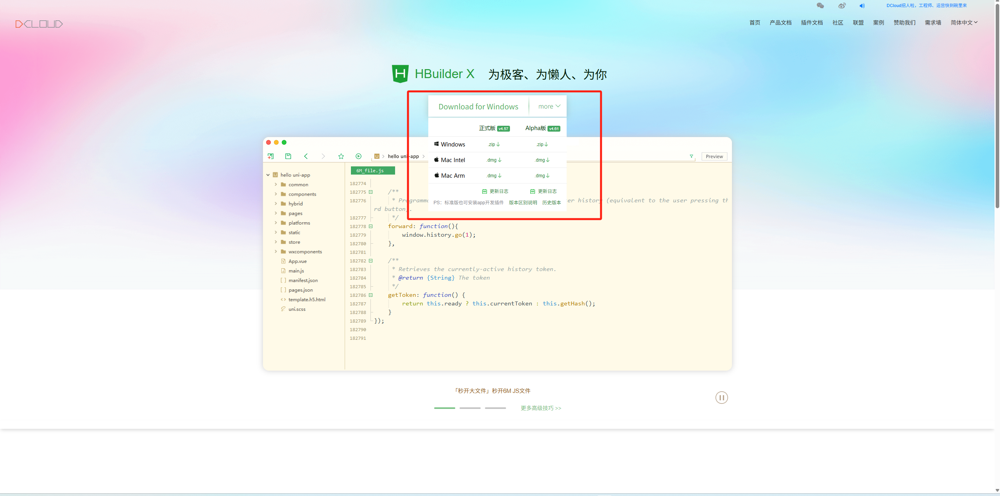

根据操作系统下载对应的版本

## 2. 可视化创建项目

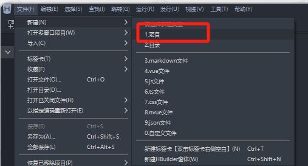

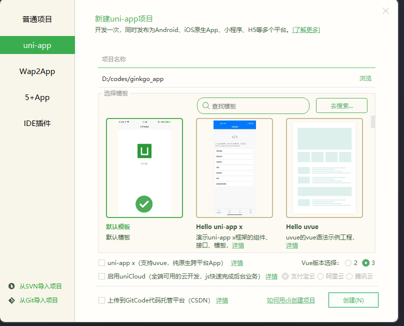

### 项目结构

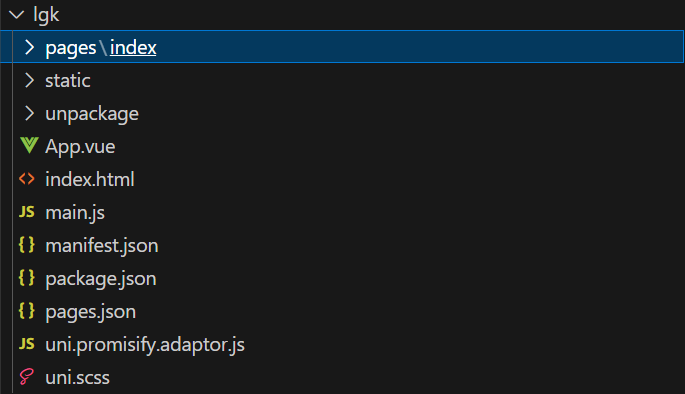

## 3. 在真机上运行项目

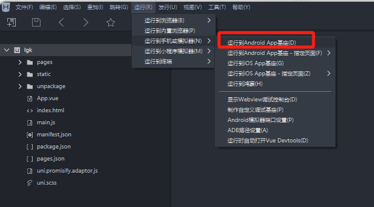

在没有链接设备会有提示

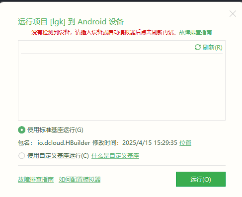

### 3.1 使用USB链接设备

1. 用USB线连接到电脑
2. 打开手机开发者模式及USB调试

具体的开启方式不同的手机不同，可自行去搜索，下面以小米手机举例

   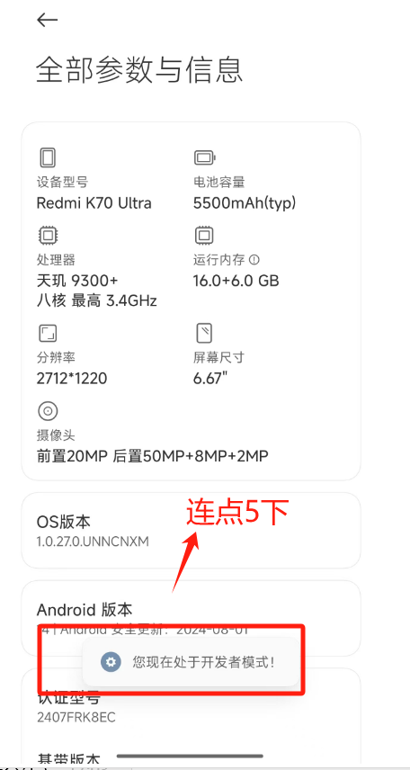

   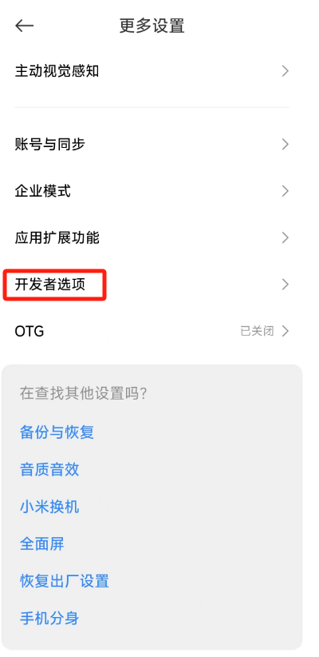

   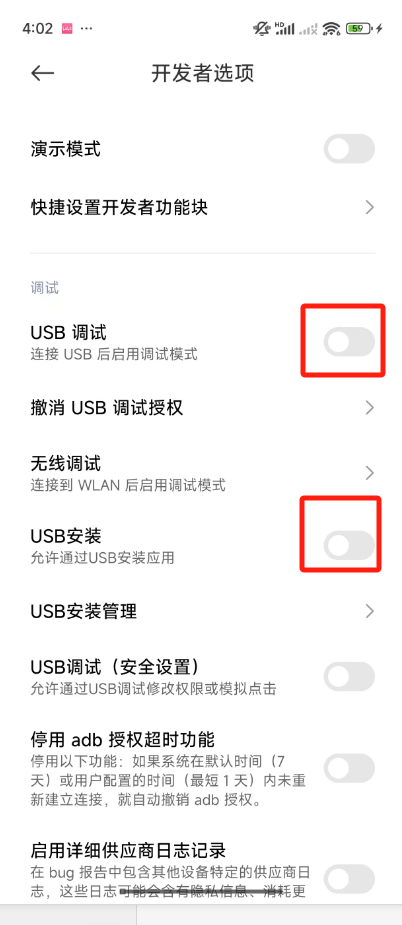

   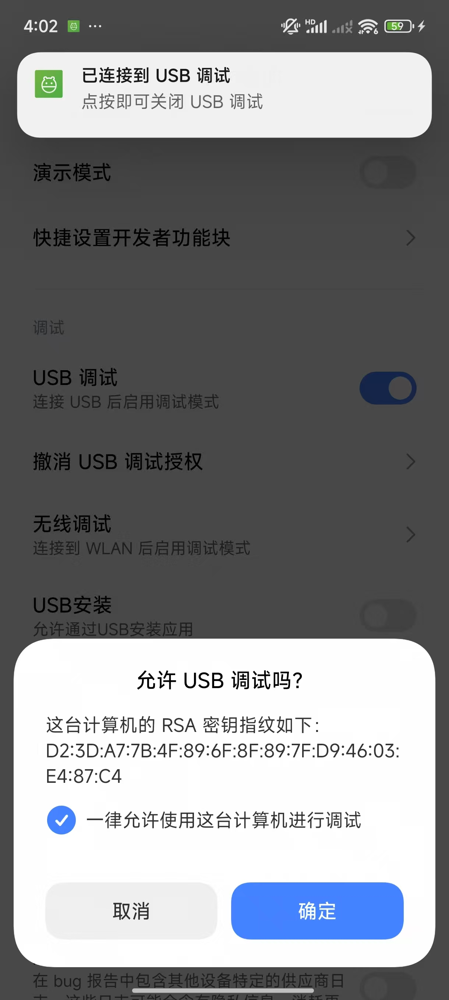

   点击确认后，手机就开启了USB调试模式，就能通过HbuilderX安装调试包了

   ### 3.2 真机安装调试包

   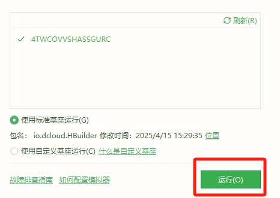

   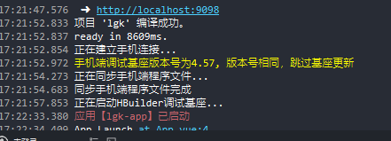

   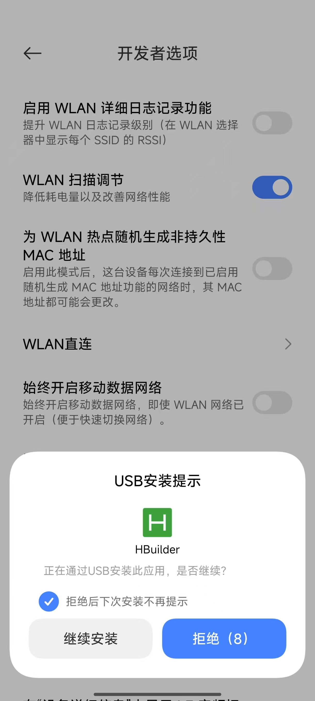

   ### 3.3 真机上看到页面

   

## 4. 真机调试

1. 更改代码后，真机上会自动热更新

2. 可以通过配置开启vue-tool工具

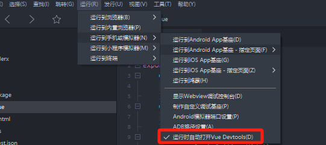

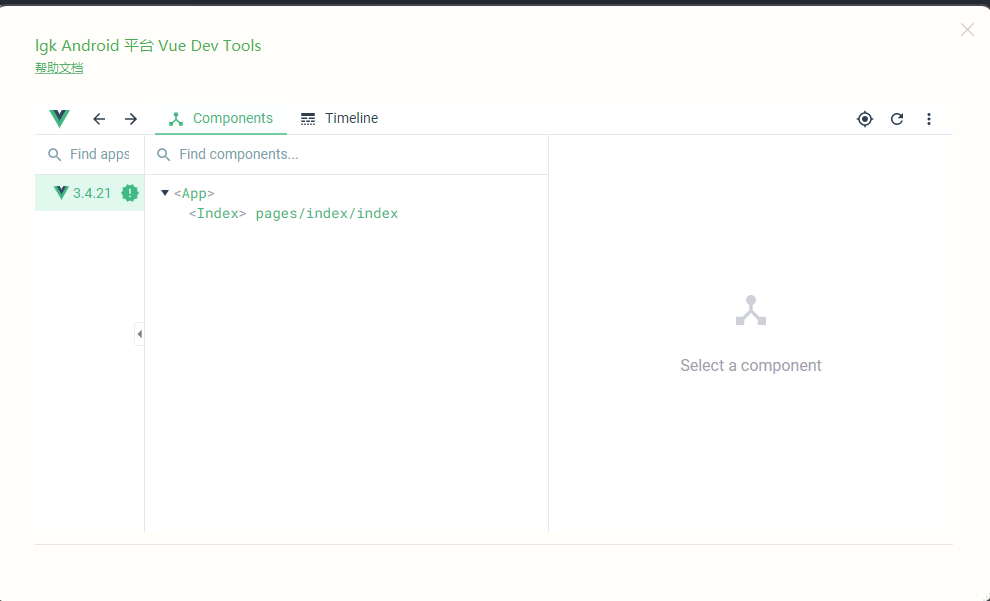 

3. 调试Dom元素，通过webview调试

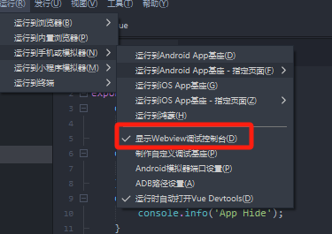

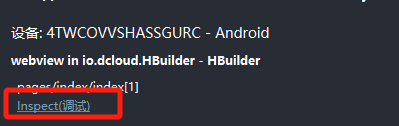

## 5. 打包APK

选择云打包
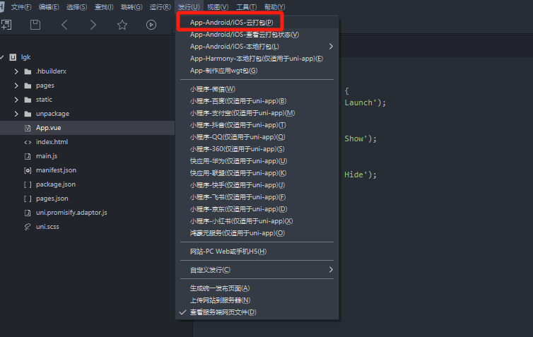

登录HBuilder账号

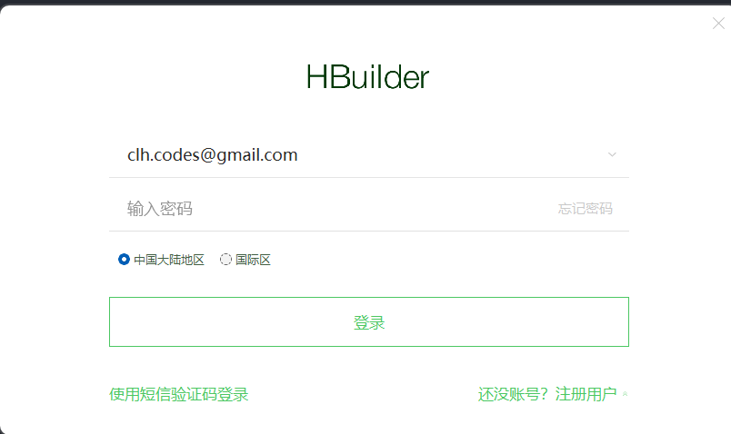

打包配置

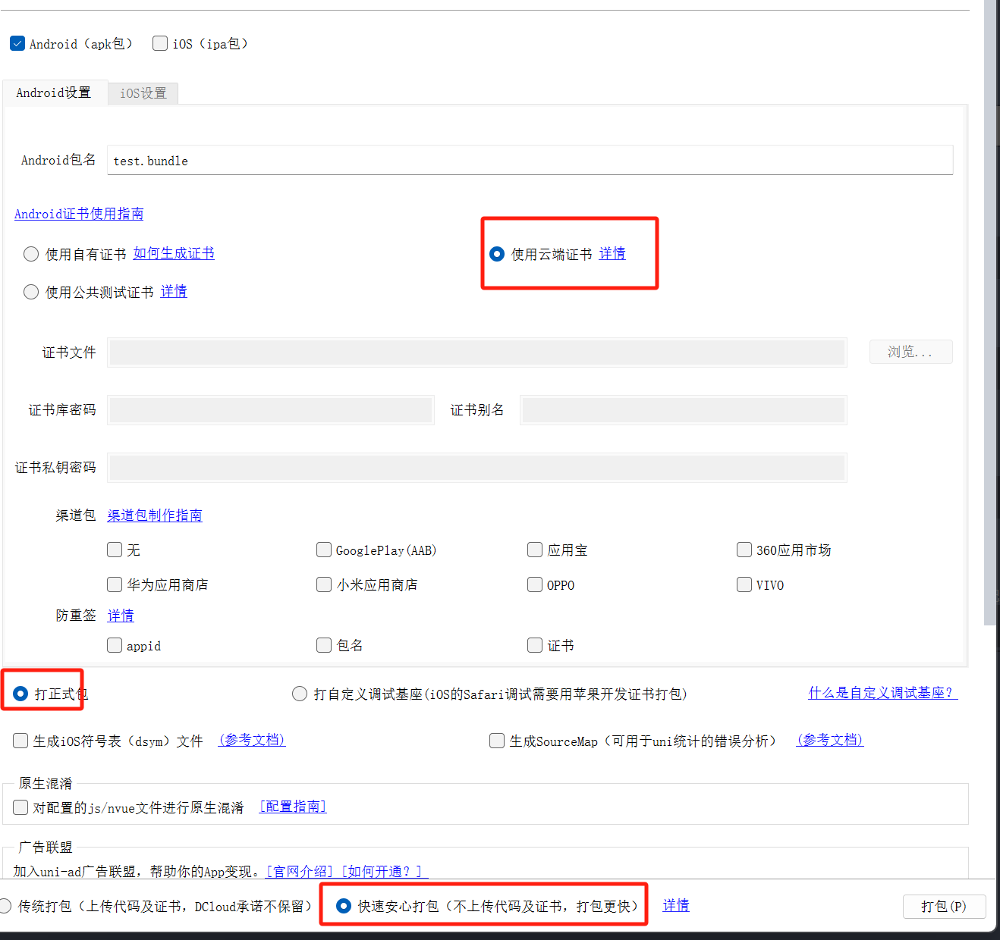

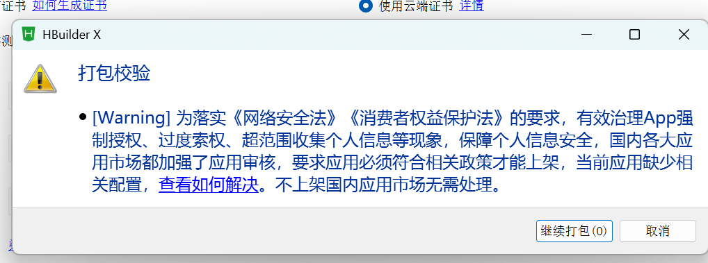

等待云端打包结果

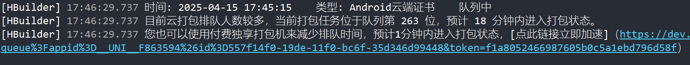

付费加速打包

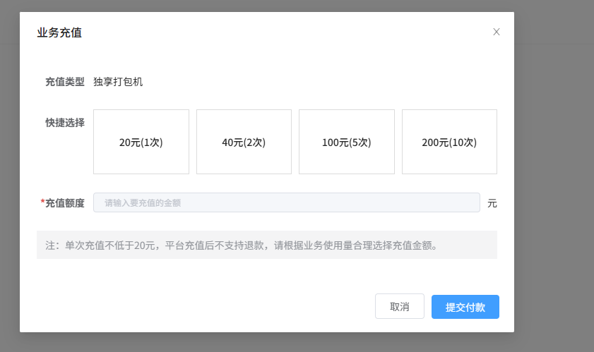

打包完成

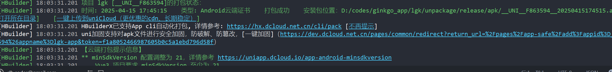

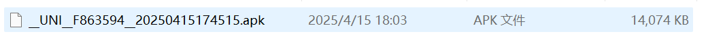

该APK可以发送给安卓手机直接安装，也可以用于上架三方市场

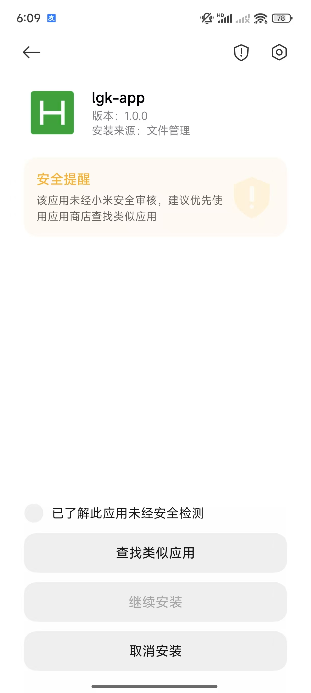

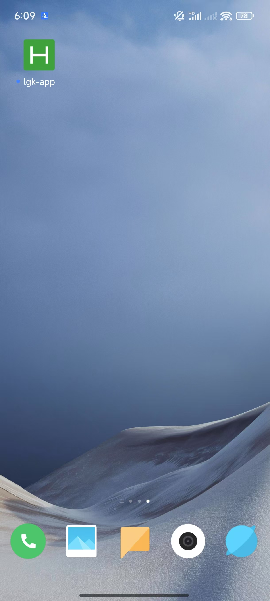