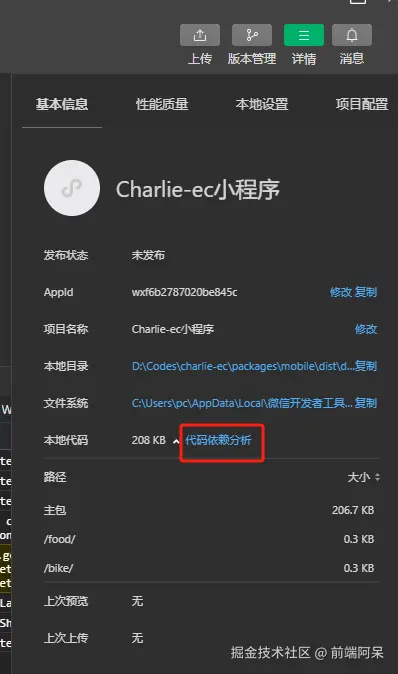
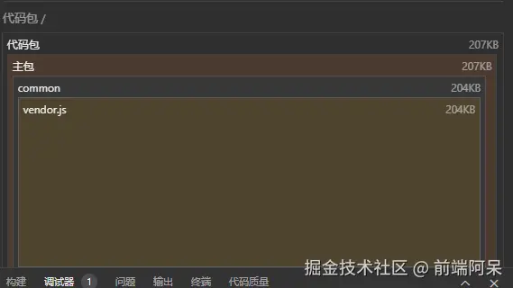
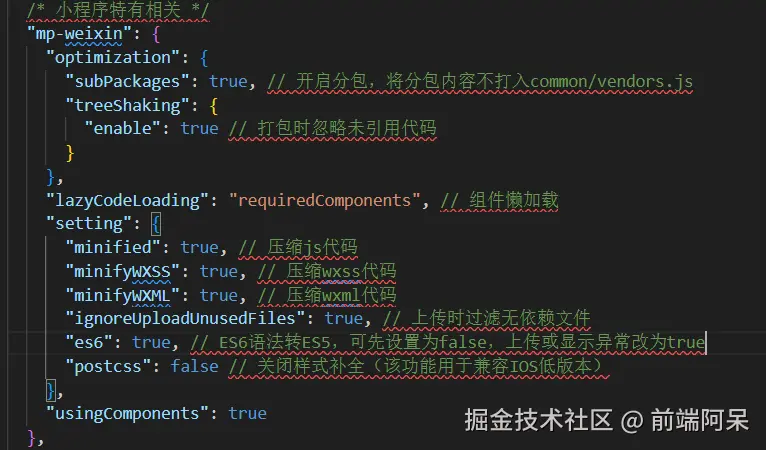
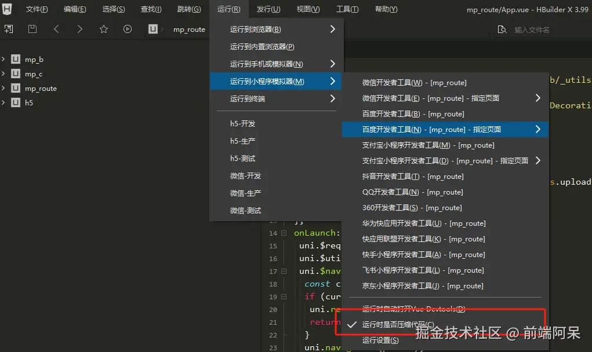
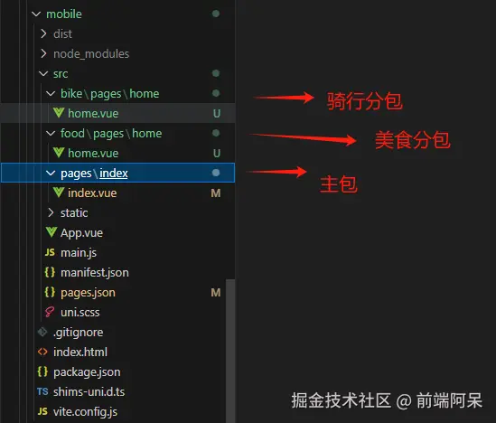
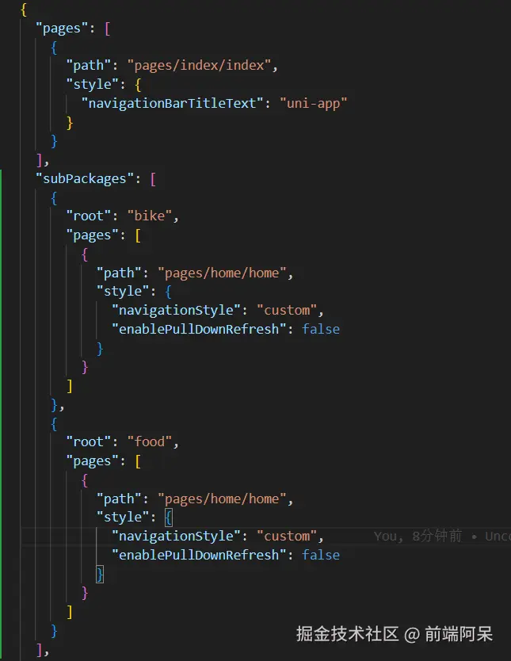
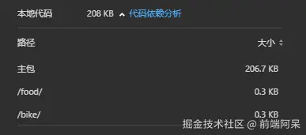
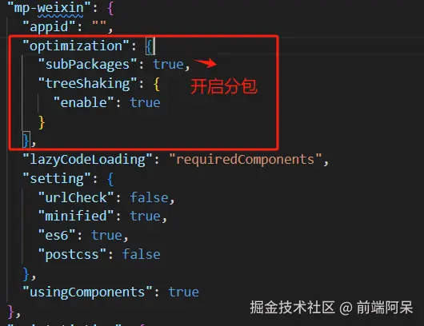

# 小程序包体积优化

## 背景介绍

因为微信的用户流量以及小程序本身的便利性，跨平台性等，越来越多的公司开始将自己的业务放到小程序上，也造就大部分前端研发需要介入小程序的开发，随着小程序业务功能越来越多，代码量越来越庞大，相信许多研发都遇到过主包体积过大，小程序无法上传的情况（主包 2M，总包 20M 限制），本文将围绕各种常见问题来讲述如何对小程序的主包进行最大程度的优化

## 常见问题

1.  小程序业务功能板块多，且每个板块功能都极其庞大，如美团小程序，美食，电影，骑行，酒店等板块中的业务量都相对较多
2.  小程序中使用的图片(如 jpg,svg)，音频等媒体文件多
3.  项目存在较多无用代码，被误打入主包中
4.  引用了较多的三方库或者某个三方库代码体积异常庞大，造成主包过大
5.  Uniapp 本身编译问题，所有从 node-modules 引用的包（无论是否只是分包使用）都会被打入主包中

**注意**:相关包体积的构成，可以在微信开发者工具的依赖关系中查看，这样可以更有针对性的确定优化方向

## 优化方案

### 代码压缩配置

- uniapp manifest.json:

- 运行时压缩代码（发行时自动会压缩，无需配置）
  - HbuilderX 编译：

\- 命令行编译：
pacakge.json,script 运行命令添加参数\*\*--minimize\*\*

- 特别说明：
  - 小程序中不支持 GZIP 文件加载，就算 Vite 配置了 GZIP 压缩，压缩后的文件也会在上传时被忽略
  - 小程序本身的 Minified 已经对脚本进行了混淆压缩，通过 terser，ugliyJs 等插件压缩代码，基本没有任何效果

### 静态资源剥离

- 小程序中使用到的所有媒体资源，如背景图片（JPG,PNG），语音提示(MP3),图标（SVG）等，全部放到 CDN 或者后端文件服务器，在运行时引入，可以极大程度减少包体积
- 如果存在较大的配置 JS/JSON 文件，也建议放到后端文件服务器，通过 get 请求运行时加载
- 注意，目前版本的小程序 JS 脚本已经无法从远程加载执行（We-script 等已经被禁用）

### 三方依赖包优化

- 能不用则不用，非要使用，按需加载
  - 如 lodash 这种大型 JS 工具库，有些新手朋友可能为了方便直接全局注册使用，会导致许多无用功能被打入包中，如果只是用到其中简单的功能，不妨按需使用，或者从源码中截出
- 能用小的，不用大的
  - 如 dayjs,momentjs 都能处理时间,moment 功能更多，但是包体积会比 dayjs 大很多倍，如果你的业务 dayjs 能满足的情况下，尽量选小的
- 只在分包中用到的，则只在分包中引用
  - uniapp 的编译原则是除了在 pages.json 中指定了的分包外的所有被引用资源都会打入到主包中，这里的资源通常包括：全局注册的公共函数，组件，多个分包引用的公共资源等等，所以如果只是分包中要用的组件或函数，尽量闭环在子包中
  - 注意：node-modules 中引用的资源，就算只是在分包中引用，也会被打入到主包中（uniapp 官方缺陷，且暂无修改计划），这里后续章节会给出对应解决思路

### 独立分包

关于独立分包，相信对于有长期小程序开发经验的同学来说都不陌生，那么什么是独立分包，它又有什么好处，该如何完成独立分包，让我们接下来一起探究

- 什么是独立分包：

  - 微信小程序在对包体积限制上分为单包限制及总包限制，单包限制为 2M，总包限制为 20M，如果你的小程序随着业务迭代，越来越重，单包逐渐到达 2M 门槛时，就必须开始进行分包，类似于 WEB 框架中的组件懒加载，在页面初始化时，用户只会看到页面 A，那么页面 A 的内容就一定需要放在主包中跟随初始化加载资源，但是页面 B 和 C 是在页面 A 进行跳转的，我们可以采取懒加载（分包加载）来进行首屏加载效率优化及规避单包限制

- 如何进行独立分包
  - 业务划分：在业务层面将各个功能板块进行分类，如美团小程序的骑行可作为一个子包，美食可作为一个子包等，后续骑行和美食的各个业务页面及功能都在分包下面开发
  - 目录结构划分，以美团小程序作为模拟场景（注意：仅自己 YY，并非美团真实架构）
  - 
  - pages.json 配置文件加入各个分包路径
  - 
  - 运行项目后查看代码依赖分析，发现已经分包成功！
  - 
  - [官方文档链接](https://uniapp.dcloud.net.cn/collocation/manifest.html#%E5%85%B3%E4%BA%8E%E5%88%86%E5%8C%85%E4%BC%98%E5%8C%96%E7%9A%84%E8%AF%B4%E6%98%8E)
  - **注意**：如果按照以上配置后分包没有成功，或者部分分包代码依然被打入了主包的 vendor.js 下面导致 vendor.js 过大，请检查根目录 manifest 中是否开启 uniapp 的启用分包配置
  - 

### node-modules 分包

文章前面提到过，Uniapp 在打包编译时，如果程序中有从 node-modules 引入的三方库，无论你是否只是在分包中使用，它都会将该三方库打入主包中，导致主包体积会异常庞大，目前官方答复为暂无支持修复计划，那么，我们遇到这个问题该如何处理呢？

- 方案 1：手动分包

  - 手动将 node-modules 中的引用代码 CV 拷贝到使用的分包目录下，并且将引用路径修改为相对路径
  - 存在问题：
    - 后续依赖版本更新，又需要再次手动维护
    - 如果存在的包多的话，迁移起来较为繁琐

- 方案 2：自动化分包
  - 思路：在 uniapp 编译前，自己写 Node.js 脚本进行预编译，去逐行解析目前项目各个子包中的 js,vue 文件，识别到有从三方组件库引入的包时（import xx from '中无/等路径符号'），截取对应包名，并且以各个子包名作为 key, 解析出对应 map 依赖表，如 {bike:\['lodash','bigjs'],food:\['lodash','momentjs']} ，根据生成的 map 表，将对应 node-modules 中的包拷贝到有依赖关系的子包的根目录下，最后将子包中原来的引用路径修改为相对路径（可在解析生成 map 表时，同步进行）

### 混合发行

后续更新

### H5 内嵌

后续更新
