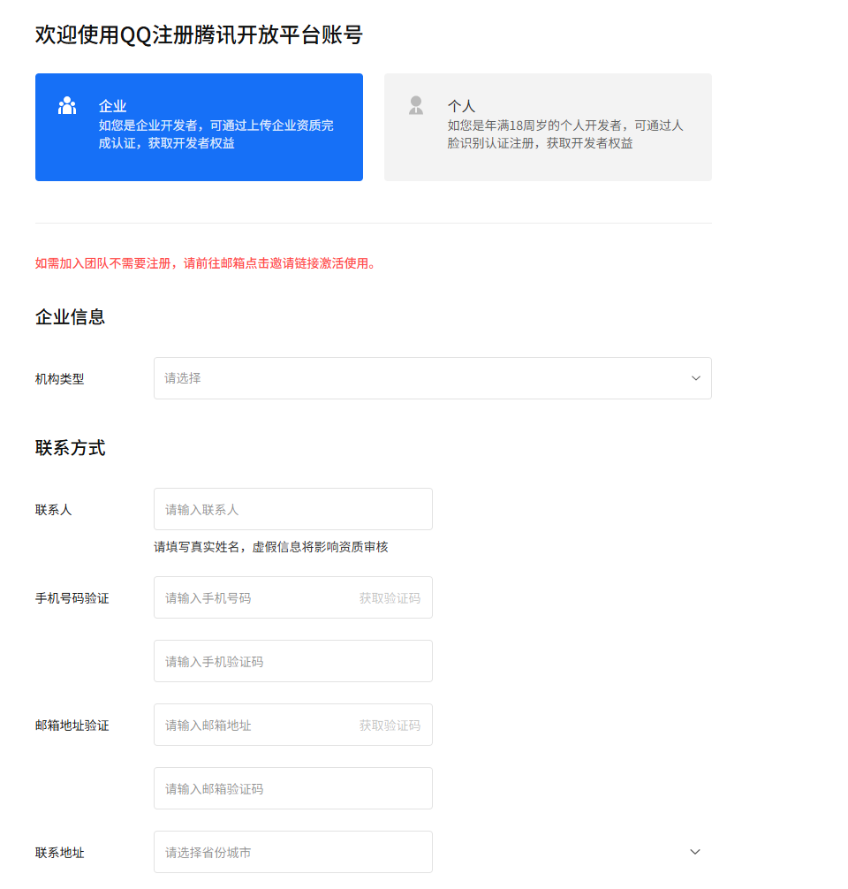
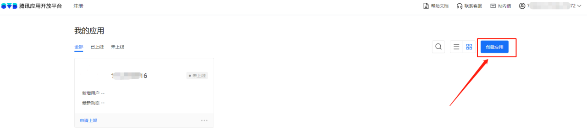
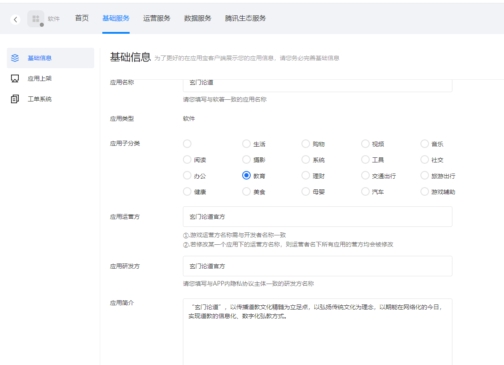
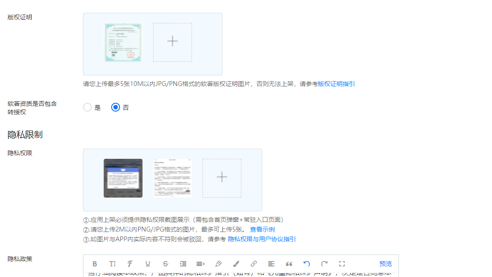
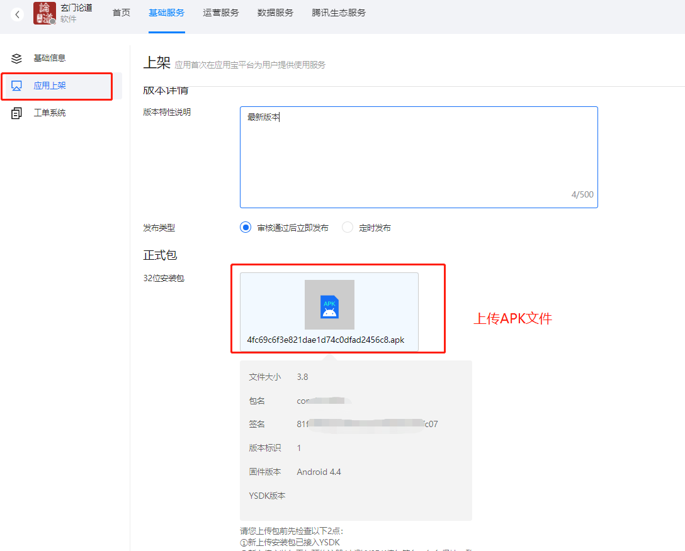

# APP上架各应用市场流程

## 安卓应用市场前置准备

1. 开发完成的可安装的Apk，及其相关介绍，图标，截图等
2. 各大应用商店的开发者账号，注册公司主体一般需要邮箱、手机号、营业执照、税务登记证、组织机构代码（三证合一的只需要营业执照）、企业法人身份证正反面、法人手持身份证照片
3. APP软著或者电子版权证明
4. 隐私采集协议
5. 其它平台资质要求

各个平台的上架流程基本一致，都分为以下几个节点：

1.注册-2.实名认证-3.创建应用-4.编辑应用信息-5.上传安装包-6.提交审核

## 腾讯应用宝

腾讯应用宝是腾讯公司推出的应用分发平台，是Android应用上架的重要渠道之一。以下是详细的上架流程：

### 1. 注册开发者账号

1. 访问[腾讯开放平台](https://app.open.qq.com/p/developer/reg)
2. 选择开发者类型（个人/企业）

3. 填写基本信息并提交相关资质
   - 企业：营业执照、法人身份证等
   - 个人：身份证、手机号验证等
4. 等待审核通过（一般1-3个工作日）

### 2. 应用信息准备

1. 应用安装包（APK文件）
   - 文件大小不超过2GB
   - 适配Android 4.4及以上系统
   - 已完成签名

2. 应用材料
   - 应用图标（512x512px，PNG格式）
   - 应用截图（至少4张，16:9比例）
   - 应用简介（详细描述应用功能特点）
   - 应用分类（选择合适的类别）

3. 隐私政策相关
   - 隐私政策文档
   - 收集个人信息清单
   - SDK使用说明

### 3. 提交审核

1. 登录[应用宝开发者平台](https://open.qq.com/)
2. 创建新应用

3. 填写应用基本信息
   - 应用名称
   - 应用类型
   - 应用子分类
   - 应用运营方
   - 应用研发方
   - 应用简介

4. 上传应用材料
   - APK文件
   - 应用图标
   - 应用截图
   - 隐私政策

5. 提交审核

### 4. 审核要点

1. 合规性要求
   - 应用内容符合法律法规
   - 无侵权行为
   - 符合隐私政策要求

2. 技术要求
   - 应用稳定性
   - 性能表现
   - 兼容性测试

3. 内容要求
   - 应用信息真实准确
   - 截图与实际功能一致
   - 分类准确

### 5. 审核时间与发布

- 首次提交：3-7个工作日
- 版本更新：1-3个工作日
- 审核通过后自动上架
- 可在开发者平台查看审核进度

### 6. 应用运营

1. 版本更新
   - 提前准备更新内容
   - 按流程提交新版本
   - 做好更新说明

2. 数据分析
   - 下载量统计
   - 用户反馈处理
   - 评分管理

3. 推广运营
   - 关键词优化
   - 应用描述优化
   - 活动参与

### 7. 注意事项

1. 审核被拒处理
   - 仔细阅读拒绝原因
   - 针对性修改
   - 及时回复审核意见

2. 安全事项
   - 定期更新应用
   - 及时修复漏洞
   - 做好用户数据保护

3. 政策遵守
   - 关注平台政策更新
   - 及时调整应用内容
   - 保持合规运营

## 苹果应用市场

## 小米应用市场

## 华为应用市场

## 百度手机助手