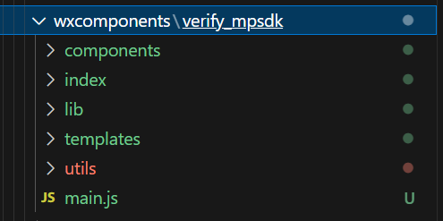
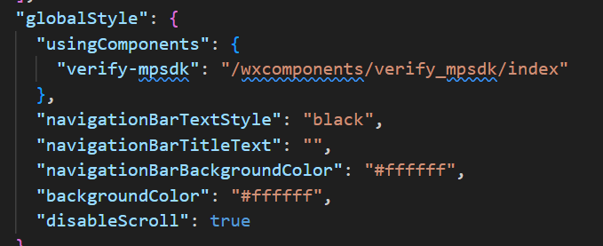
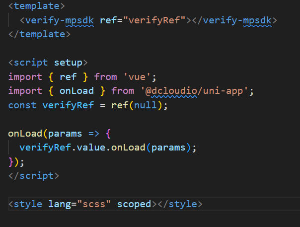

# Uniapp 使用微信原生 SDK 实战

Uniapp 本身是不支持引用微信原生页面的，本文以实际业务中对接微信慧眼人脸识别 SDK 作为 Demo,来介绍如何在 Uniapp 项目中集成微信三方 SDK 页面

## 具体步骤

Uniapp 虽然不支持引用原生页面，但是支持在页面中引用自定义组件，我们首先将三方 SDK 注册为自定义组件

1. 在根目录创建 wxcomponets,并且将三方 SDK 放入

2. 在 pages.json 中注册该组件(也可以在对应页面的 style 中配置)
   

3. 创建一个 uniapp 页面用于承载该 SDK 组件,并且通过 Ref 来调取组件内通过 onLoad 执行的函数

4. 在 SDK 目录下搜索原跳转路径，替换为你用于承载的 uniapp 页面路径

## 参考地址

- [小程序自定义组件支持](https://uniapp.dcloud.net.cn/tutorial/miniprogram-subject?id=%E5%B0%8F%E7%A8%8B%E5%BA%8F%E7%BB%84%E4%BB%B6%E6%94%AF%E6%8C%81)
