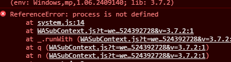

# Uniapp 中自定义环境变量及编译变量

## 前言

在我们进行跨端开发中，基本都会遇到因为环境导致的代码差异需要兼容，比如生产环境和测试环境需要调用不同的接口地址，又比如 H5 和小程序上需要运行不同的交互逻辑

本文主要讨论如何在 Uniapp 中使用自定义的环境变量及条件编译变量，达到一套代码兼容多端多环境的目的

## 环境变量

在 Uniapp 中其实有内置的配置环境变量的方案，[参考地址](https://uniapp.dcloud.net.cn/collocation/package);但是经过亲测后，发现 H5 中是可用的，但是小程序中是不可用的，具体报错如下


为了同时兼容两端，我们在此引用三方包 cross-env 来实现需求

### Cross env

#### 简介

cross-env 是一个常用的 npm 包，用于在不同操作系统中设置环境变量，确保在跨平台时环境变量的设置方式一致。它特别有用，因为不同操作系统设置环境变量的方式不同

#### 使用步骤

1. 安装：npm install --save-dev cross-env
2. 配置 script 脚本前加上 cross-env 运行脚本并注入环境变量

   配置前

   ```json
   {
     "scripts": {
       "start": "node server.js"
     }
   }
   ```

   配置后

   ```json
   {
     "scripts": {
       "start": "cross-env TEST_VAR=dev node server.js",
       "test": "cross-env TEST_VAR=test node server.js"
     }
   }
   ```

   3.访问环境变量

一般来说，在完成上述配置后，我们便可以通过 process.env.TEST_VAR 来访问到环境变量了，但是 Uniapp 因为编译比较特殊，使用这种办法是访问不到的，而需要通过 vite.config(或者 vue.config)文件来中转

```js
const TEST_VAR = process.env.TEST_VAR;
export default defineConfig({
  ...,
  define: {
    TEST_VAR: JSON.stringify(TEST_VAR),
  },
});
```

这样就能将 TEST_VAR 作为全局变量去进行使用了

```js
const baseUrlMap = {
  dev: "https://dev/api/xx",
  test: "https://test/api/xx",
};

export const getBaseUrl = () => {
  return baseUrlMap[TEST_VAR];
};
```

## 编译变量

通过上述操作后，我们已经可以通过环境变量来进行一些差异化的适配开发了，那么编译变量又是什么作用呢？

环境变量一般定义在编译时，但是使用在运行时，但是如果我们需要在编译时去判断哪些代码需要在哪个环境下才编译到 dist 里，这个时候环境变量就无法实现了，Uniapp 提供了自定义编译变量来实现目的，[参考文档](https://uniapp.dcloud.net.cn/collocation/package.html)

该文档中有具体的 HbuilderX 编译或者 Cli 编译时如何使用编译变量，在此不再赘述，最终我们将 cross-env 和这个方案相结合，就能同时实现环境变量及编译变量

```json
"dev:h5-dev": "cross-env COMP_ENV=DEV uni -p h5-dev",
```
