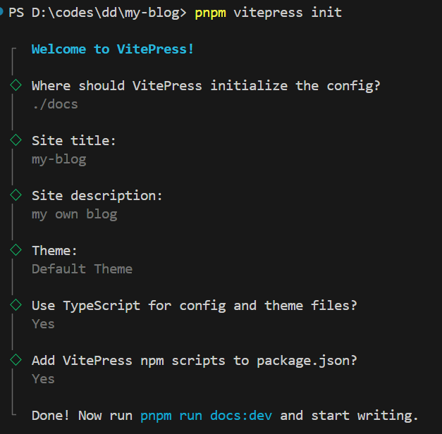
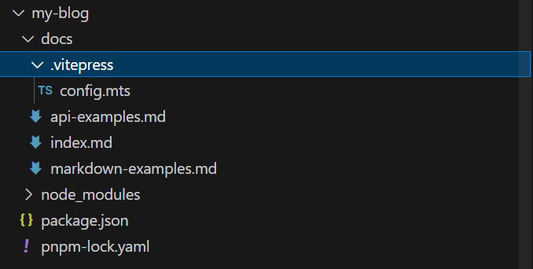
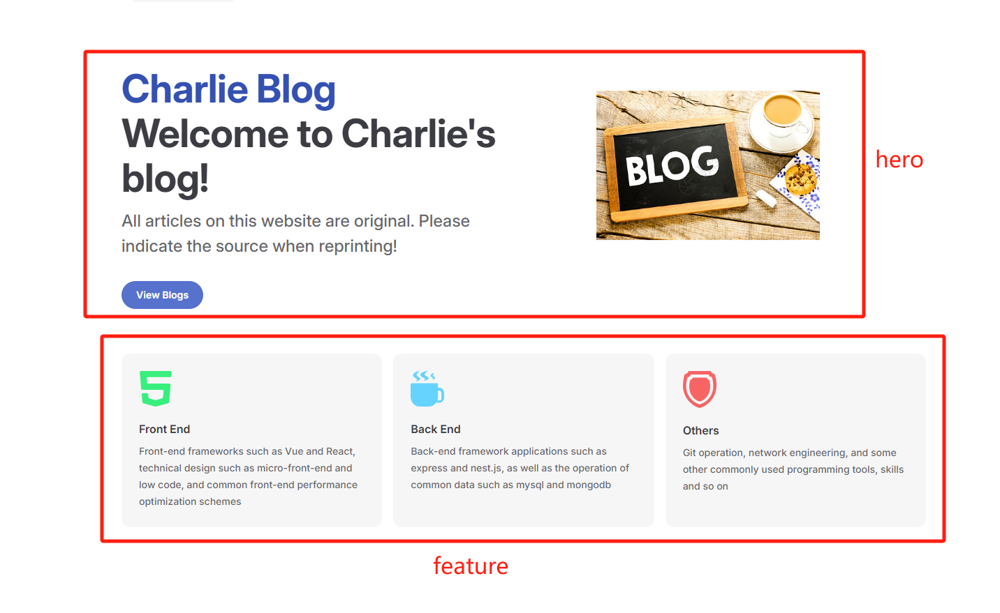
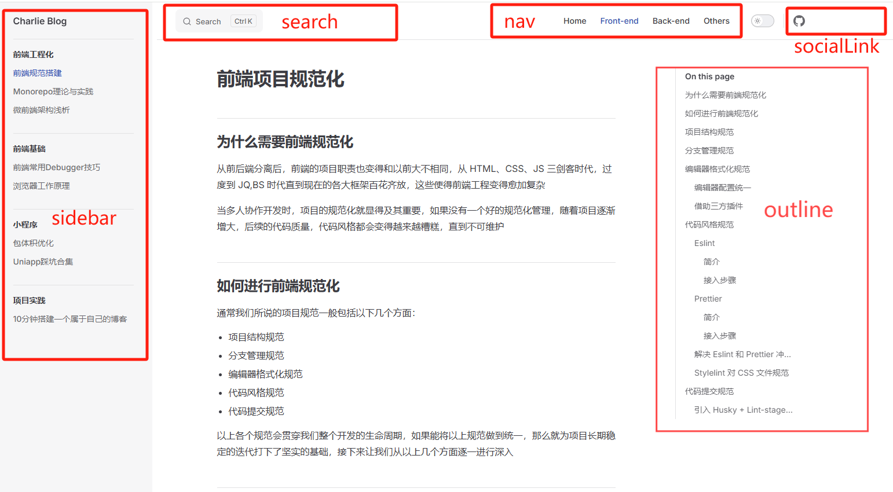
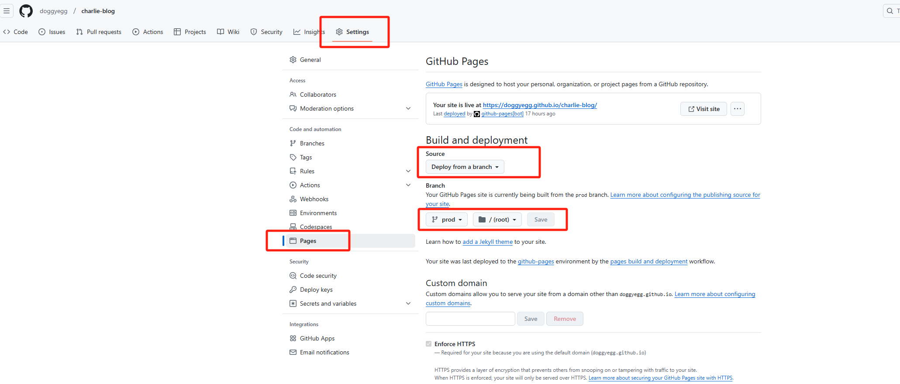

# Vitepress 快速搭建专属博客

## VitePress 简介

VitePress 是一个底层为 Vue 的静态站点生成器 (SSG)，专为构建快速、以内容为中心的站点而设计。简而言之，VitePress 获取用 Markdown 编写的内容，对其应用主题，并生成可以轻松部署到任何地方的静态 HTML 页面。

## 项目搭建

### 新建项目文件夹，并且进行项目初始化（以 pnpm 为例）

```
mkdir my-blog
cd ./my-blog
pnpm init

pnpm i vitepress -D
pnpm vitepress init
```

初始化会进行配置问答，完成后会得到一个基础的 vitepress 项目



项目结构如下



### 首页搭建（docs/index.md）



```markdown
layout: home // 声明当前页面的模块结构为首页，默认为 page

hero: // banner 部分
name: "Charlie Blog" // 主标题
text: "Welcome to Charlie's blog!" // 副标题
tagline: All articles on this website are original. Please indicate the source when reprinting! // 内容区
image: // 图片区
src: /home/home-banner.jpg // 图片地址
alt: 加载失败 // 图片加载失败提示语
actions: - theme: brand // 按钮区域
text: View Blogs // 按钮文案
link: /front/engi/rule // 跳转链接，以 docs 为根路径

features: // 功能区

- title: Front End // 标题
  icon: // 图标
  src: /home/front-end-icon.svg // 图标地址
  link: /front/engi/rule // 跳转链接
  details: Front-end frameworks such as Vue and React, technical design such as micro-front-end and low code, and common front-end performance optimization schemes // 文案描述
- title: Back End
  icon:
  src: /home/back-end-icon.svg
  link: /back/index
  details: Back-end framework applications such as express and nest.js, as well as the operation of common data such as mysql and mongodb
- title: Others
  icon:
  src: /home/network-icon.svg
  link: /others/operation/git
  details: Git operation, network engineering, and some other commonly used programming tools, skills and so on
```

### Layout 搭建（docs/.vitepress/config.mts）



```mts
import { defineConfig } from "vitepress";
import utils from "./utils";
const { getSideBar } = utils;

export default defineConfig({
  base: "/charlie-blog/", // 项目根路由，github部署后的基础路由如:xx.github.io/charlie-blog/
  title: "Charlie Blog", // 浏览器标签标题
  // 浏览器标签的favicon
  head: [
    [
      "link",
      {
        rel: "icon",
        type: "image/svg+xml",
        href: "/charlie-blog/websiteLogo.svg",
      },
    ],
  ],
  description: "Welcome to Charlie's blog!", // 浏览器检索关键字
  cleanUrls: true, // 路由地址隐藏.html
  themeConfig: {
    logo: "/websiteLogo.svg", // 站点标题前的icon
    outline: "deep", // 文章目录显示方式，deep为完整显示，false不显示，[1,3]显示1-3级
    // 导航区域，text:文本  link:对应跳转链接  activeMatch,当路由里包含xx时，该项高亮
    nav: [
      { text: "Home", link: "/" },
      { text: "Front-end", link: "/front/engi/rule", activeMatch: "/front/" },
      { text: "Back-end", link: "/back/index", activeMatch: "/back/" },
      { text: "Others", link: "/others", activeMatch: "/others/" },
    ],

    // 启动本地搜索功能
    search: {
      provider: "local",
    },
    // key:当路由中匹配到该项，value:返回值为对应的侧边栏，具体后边单独讲解
    sidebar: {
      "/front/": getSideBar("front"),
      "/back/": getSideBar("back"),
      "/others": getSideBar("others"),
    },
    // 可以添加外部社交网站地址，如github,掘金，微博等等
    socialLinks: [
      { icon: "github", link: "https://github.com/doggyegg/charlie-blog" },
    ],
    // 底部区域，一般为版权相关
    footer: {
      message: "本站所有内容均为原创，转载请注明出处",
      copyright: "Copyright © 2024-present charlie-chen",
    },
  },
});
```

### 根据路由动态设置侧边栏

1. 在 config.mts 同级新建文件 utils.ts,并且暴露出 getSideBar 函数，在 getSidebar 函数中配置 Sidebar 数据

```ts
export default {
  getSideBar(path) {
    const wholeList = [
      {
        text: "front", // 显示文本
        // collapsed: true,  // 子项是否可收起
        // 下钻子项
        items: [
          {
            text: "前端工程化",
            items: [
              {
                text: "前端规范搭建",
                link: "/front/engi/rule/",
              },
            ],
          },
        ],
      },
      {
        text: "back",
        items: [
          {
            text: "Framework",
            items: [
              {
                text: "Nest.js",
                link: "/back/nest/",
              },
            ],
          },
        ],
      },
      {
        text: "others",
        items: [
          {
            text: "常用操作指令",
            items: [
              {
                text: "MarkDown",
                link: "/others/operation/",
              },
            ],
          },
        ],
      },
    ];

    if (!path) {
      return wholeList;
    }

    return wholeList.filter((list) => list.text === path)[0];
  },
};
```

2. 在 config.mts 文件中使用，具体参考 Layout 搭建中的代码

### 文章路径说明及编写规则

- 路由均由 docs 为根路径，如文件目录为 /docs/front/engi/rule.md,则路由为/front/engi/rule
- 文章编写按照 MD 语法编写即可

## 自动化部署到 github

### 编写 github-workflow 脚本

1. 在项目根目录（与 docs 同级）

```
mkdir .github/workflows
cd ./.github/workflows

创建deploy.yml文件，并且粘贴以下代码

name: charlie-blog deploy workflow

# 设置触发时机，当推送master分支或者tag到远程时触发
on:
  push:
    tags:
      - "*"
    branches:
      - master
  workflow_dispatch:
# 各个脚本节点命令
jobs:
  deploy-and-sync:
    # 执行环境为linux的ubuntu系统
    runs-on: ubuntu-latest
    steps:
      # 从master分支拉取代码
      - name: Checkout 🛎️
        uses: actions/checkout@v4
        with:
          ref: "master"
      # 安装pnpm
      - name: Install pnpm
        run: |
          corepack enable
          corepack prepare pnpm@latest --activate
      # 安装node环境
      - uses: actions/setup-node@v3
        with:
          node-version: "18"
          cache: "pnpm"
      # 使用pnpm安装依赖
      - name: Install dependencies
        run: pnpm install
      # 打包vitepress项目
      - name: Build Site
        run: pnpm run docs:build
      # 将打包后dist里的产物提交到prod分支
      - name: Deploy for Github 🚀
        uses: JamesIves/github-pages-deploy-action@v4.4.1
        with:
          branch: prod
          folder: docs/.vitepress/dist
          single-commit: true
          clean: true

```

2. 在项目创建 prod 分支，用于 github 自动化脚本打包后的部署分支
3. 在 github 仓库中进行 io 设置
   

配置完成后，当你每次在 master 分支提交代码或者推送 tag 时，github 都会自动化执行打包命令，并且将生成的 dist 文件目录下的产物覆盖拷贝到 prod 分支，然后以 prod 分支作为根路径进行静态资源部署

成功后，可以通过 https://<github 账号名>.github.io/<config 中配置的 base>/ 来访问你的项目，如<https://doggyegg.github.io/charlie-blog/>

如果无法显示，请在 github actions 中查看对应失败原因，并做调整
