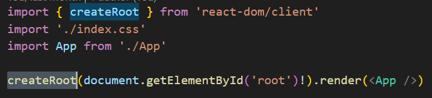

# React-hooks源码阅读随记

## createRoot



main.js的起点，接受参数为dom节点，生成的实例对象上有render函数，将React-node传入，完成根组件的挂载

- <App  /> 在 babel编译后，是调用React.createElement(App, null);
- 该函数会返回ReactElement对象，在React调和阶段会调用该对象上的type，也就是指向App函数

```js
{
  type: App,
  props: {},
  key: null,
  ref: null,
  $$typeof: Symbol(react.element)
}

```

- createRoot 调用 createContainer => createFiberRoot =>new FiberRootNode && createHostRootFiber , 在这里创建了Fiber树结构的根及组件树的起点
- 返回值为 new ReactRootElement(), 上面会调用render()
- 每个函数组件经过babel编译后，都会生成对应实例，在后续reconcile阶段，会通过createFiberFromElement生成对应fiber节点，fiber节点上有memoizedState ，指向该组件的第一个Hook，每个Hook上的next指向下一个hook,形成链表, hook不会按照分类来储存，就是单纯按照定义的顺序来进行储存，如果是自定义hooks，会将自定义hook中用到的内部hook加入到链表中，demo如下，这也是为什么hook不能写在条件判断中，那样会打乱hook调用和更新的顺序，出现异常

```js

// 自定义Hook
function useCustomHook() {
  const [value, setValue] = useState(0);     // 会被加入hooks链表
  useEffect(() => {/*...*/}, []);           // 会被加入hooks链表
  return value;
}

function MyComponent() {
  const [count, setCount] = useState(0);     // hook #1
  const customValue = useCustomHook();       // 这里会展开成两个hook (#2, #3)
  const [name, setName] = useState("");      // hook #4
}

```