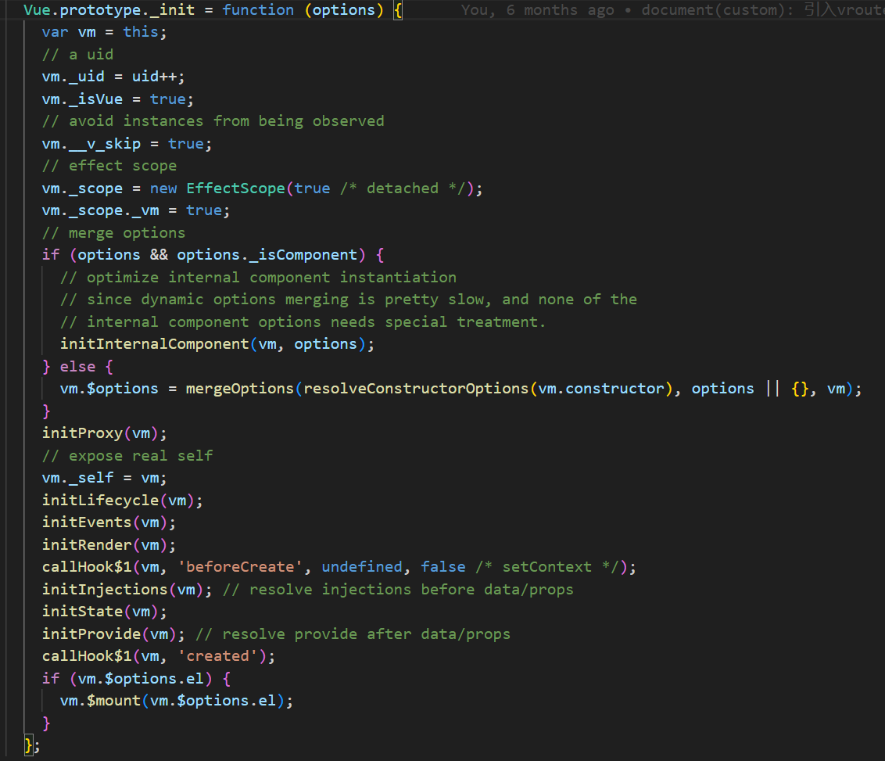

# Vue2源码之响应式及队列调度

## 前言

相信使用过Vue的前端开发者对于Vue数据驱动的思想已经非常熟悉，但是究竟Vue是如何做到修改数据后，视图自动更新的呢？本文将结合源码探究从数据变化到视图更新的过程中发生了哪些事情


## 一切的起点- new Vue


从main.js中的new Vue，到$mount将视图及数据绑定，并且挂载真实Dom之间，Vue内部发生了些什么事呢，我们结合源码一起看看


上述代码是Vue的构造器函数，我们能看到new Vue时，其实只是调用了_init函数，并且将我们定义的options传入，options即为我们业务代码里export default 暴露的对象，里面包含了data,props,computed,watch,methods等等



我们可以看出在_init中，vue完成了大部分的初始化工作，包括生命周期，事件，render函数，各个状态值等等，为了减少阅读成本，我们先只深入**initState**中，看看Vue是做到数据驱动视图的


在initState中，主要对props,methods,data,computed,watch分别进行了初始化，初始化的过程就是数据实现响应式的过程

 **initData**


从上述代码里我们可以看到，在observe（data）调用前，所有的代码都是一些边界处理及错误的前置判断

首先会根据你传入的data是函数还是对象，来决定data的获取方式，拿到data后，会去遍历data里的key，分别和methods及props中的key进行对比，看是否同名，我们能够直观的看出，具体优先级是props> data > methods的 

在处理完各种判断后，调用了observe函数并且将data进行了传入


在observe中，也是先做了一些前置判断，如已经observe过的对象会有一个__ob__属性，这个时候就不会再次调observe减少性能开销，接着if判断中，有许多判断条件做边界处理，我们逐个讲解下

1. shouldObserve: 固定变量，写死的true，vue开发人员用于代码调试时使用
2. ssrMockReactivity || !isServerRendering : 当vue是服务端渲染的情况，这里暂不探究
3. isArray || isPlainObject : 只有数组和对象才会进行observe处理，这里非常重要，后续observe函数会被递归调用，用于响应式的深度处理，如data:{obj1:{obj2:{name:'zs'} } },obj2也具备响应式，该判断条件作为递归的结束条件
4. Object,isExtensible, !value.__v_skip , !isRef(value), !value instanceof VNode: 这些判断条件分别是判断对象是否能够扩展，是否需要跳过observe,是否是compositionApi的ref函数处理过，是否本身就是VNode(虚拟节点)，我们暂时都默认为true即可

判断条件都符合后，这里会new Observer对象 ，并且传入了value,这里的value，我们可以看出，其实就是我们写的options中的data


Observer的构造器函数中，我们可以看到主要是做了以下几件事
1. 将传入的对象放到实例的value上
2. 确定shallow的值，用于判断本次监听是深度还是非深度，非深度仅监听对象地址值变化，深度的话会同时监听对象里的属性变化
3. new一个Dep对象，并且放到该observer实例的dep属性上
4. 将当前实例同时添加到传入的value对象上的__ob__属性上，避免后续同个对象多次执行observer
5. 如果Value是数组的话调用observeArray函数进行监听
6. 如果Value是对象的话，遍历其所有属性，每次都会调用defineReactive函数去进行响应式监听


我们先来看如果value是数组的情况，其实这里会对数组的每一项遍历，本质上是再次调用observe函数，形成递归，如果当前遍历项是数组，则会在observe调用new Observer时继续执行observeArray, 如果是对象则会在new observer时调用defineReactive，如果是基本数据类型，则在observe函数中不符合if条件，停止递归


defineReactive是响应式体系中最核心的一个函数，我们常说的defineProperty监听对象各个属性的set和get就是在这里完成的

结合前文，我们知道当前调用defineReactive是在new Observer时，判断当前的value是对象时，会遍历该对象的key，并且每次将对象及当前遍历的key传入defineReactive,所以我们能够知道，defineReactive的执行单位是对象上的每个key

整个defineReactive中最核心的逻辑如下：

1. 实例化一个Dep对象，并且通过闭包的方式与在传入的obj及key形成访问关联,这个dep实例的作用是用于存放及派发watcher，在此暂时可以简单将watcher理解为一个个回调函数，在监听的数据变化后，会去调用这些回调函数来更新视图或者处理其它副作用，后面会详细介绍各类watcher
2. 通过Object.defineProperty去对传入的对象进行数据劫持，在get的时候（也就是访问对象的当前key时）会调取步骤1中创建的dep实例的depend方法，收集watcher，在set的时候（也就是修改当前对象当前key的值时）会去调用dep实例的notify函数，去派发watcher，派发watcher本质上就是执行一个个回调函数，其中包含了通过操作dom来更新视图得update函数

到目前为止，我们已经初步了解了从new Vue到data的各个属性具备响应式的全过程，我们先对这个过程的调用栈进行小结

new Vue(options) => _init(options)=> initState(vm)=>initData(vm)=> observe(data)=> new Observer(data) => defineReactive(data,key)=>get=>dep.depend=>set=>dep.notify=>_update()

在该过程中，options中的data的各个属性值均通过Object.defineProperty进行数据劫持，在get时，会去调取dep实例的depend方法，收集watcher，在set时，会去调用dep实例的notify方法，调用前面get时收集到的watcher, 而这些watcher本质是就是函数，其中就包括了Vue._update这个更新视图的函数，执行时，Vue就会通过操作dom的方式让真实Dom更新，从而达到页面视图重新渲染的目的

## Vue的核心类

在第一部分 new Vue的章节中，我们对从数据变化，到视图更新的流程有了大致的了解，但是一些细节上的东西还是比较模糊的，比如 dep实例的depend 和 notify函数究竟是怎么收集和派发watcher的,watcher又是什么，在哪生成，有什么作用等等，接下来我们会讲解vue2响应式体系中除了上文已经提到的Observer外，另外2个核心的类,Dep及Watcher

### Dep

在Vue的响应式系统中，Dep类扮演着"依赖收集器"的角色，它负责收集和管理数据属性的所有依赖（即Watcher实例）。每个响应式属性都会对应一个Dep实例。让我们通过源码深入了解它的实现：

```javascript
// src/core/observer/dep.js
let uid = 0 // 用于生成唯一的dep id

export default class Dep {
  static target: ?Watcher;  // 当前正在计算的watcher
  id: number;               // dep实例的唯一标识
  subs: Array<Watcher>;     // 存储该dep收集的所有watcher

  constructor () {
    this.id = uid++
    this.subs = []
  }

  // 添加一个watcher到订阅列表
  addSub (sub: Watcher) {
    this.subs.push(sub)
  }

  // 从订阅列表中移除一个watcher
  removeSub (sub: Watcher) {
    remove(this.subs, sub)
  }

  // 依赖收集，当前watcher订阅这个dep
  depend () {
    if (Dep.target) {
      Dep.target.addDep(this)
    }
  }

  // 通知所有订阅者进行更新
  notify () {
    // 复制订阅者列表
    const subs = this.subs.slice()
    // 按照watcher的创建顺序排序，确保更新的顺序：父组件的watcher先于子组件
    subs.sort((a, b) => a.id - b.id)
    
    // 逐个通知watcher进行更新
    for (let i = 0, l = subs.length; i < l; i++) {
      subs[i].update()
    }
  }
}

// 全局唯一的target，同一时间只能有一个watcher被计算
Dep.target = null
const targetStack = []

// 在需要收集依赖时将当前watcher推入栈中
export function pushTarget (target: ?Watcher) {
  targetStack.push(target)
  Dep.target = target
}

// 依赖收集完成后将当前watcher从栈中弹出
export function popTarget () {
  targetStack.pop()
  Dep.target = targetStack[targetStack.length - 1]
}
```

Dep类的核心设计要点：

1. **全局唯一的Dep.target**：
   - 通过静态属性Dep.target存储当前正在计算的watcher
   - 使用targetStack栈管理watcher的收集顺序
   - 确保同一时刻只有一个watcher被收集为依赖

2. **依赖收集过程**：
   - 当访问响应式数据时，触发getter
   - getter中调用dep.depend()收集当前watcher作为依赖
   - depend方法通过Dep.target.addDep建立dep和watcher的双向关系

3. **更新通知机制**：
   - 数据变化时，setter调用dep.notify()
   - notify方法会对订阅者进行排序，确保更新顺序的正确性
   - 遍历所有订阅者，调用其update方法进行更新

### Watcher

Watcher是Vue响应式系统的另一个核心类，它负责执行数据变化时的更新操作。在Vue中，Watcher有三种主要类型，每种类型都有其特定的用途和行为：

1. **渲染Watcher (Render Watcher)**：
   - 在组件挂载时创建($mount())
   - 负责组件视图的更新
   - 优先级最低

2. **计算属性Watcher (Computed Watcher)**：
   - 在初始化computed时创建(initComputed$1())
   - 具有lazy特性，只在被访问时才计算
   - 优先级中等

3. **用户Watcher (User Watcher)**：
   - 通过watch选项或$watch API创建 (initWatch)
   - 用于监听数据变化并执行回调
   - 优先级最高

让我们看看Watcher类的具体实现：

```javascript
// src/core/observer/watcher.js
export default class Watcher {
  vm: Component;           // 组件实例
  expression: string;      // 要监听的表达式
  cb: Function;           // 回调函数
  id: number;             // watcher的唯一标识
  deep: boolean;          // 是否深度监听
  user: boolean;          // 是否是用户watcher
  lazy: boolean;          // 是否是计算属性watcher
  sync: boolean;          // 是否同步更新
  dirty: boolean;         // 计算属性是否需要重新计算
  active: boolean;        // watcher是否激活
  deps: Array<Dep>;       // 当前watcher依赖的所有dep
  newDeps: Array<Dep>;    // 新一轮依赖收集的dep
  depIds: SimpleSet;      // 当前依赖的dep id集合
  newDepIds: SimpleSet;   // 新依赖的dep id集合
  getter: Function;       // 获取监听值的函数
  value: any;             // 当前值

  constructor (
    vm: Component,
    expOrFn: string | Function,
    cb: Function,
    options?: ?Object,
    isRenderWatcher?: boolean
  ) {
    this.vm = vm
    // 如果是渲染watcher，保存到vm._watcher
    if (isRenderWatcher) {
      vm._watcher = this
    }
    vm._watchers.push(this)
    
    // 初始化配置
    if (options) {
      this.deep = !!options.deep
      this.user = !!options.user
      this.lazy = !!options.lazy
      this.sync = !!options.sync
      this.before = options.before
    } else {
      this.deep = this.user = this.lazy = this.sync = false
    }
    
    this.cb = cb
    this.id = ++uid
    this.active = true
    this.dirty = this.lazy // 计算属性watcher初始化时dirty为true
    
    // 用于依赖收集
    this.deps = []
    this.newDeps = []
    this.depIds = new Set()
    this.newDepIds = new Set()
    
    // 设置getter
    if (typeof expOrFn === 'function') {
      this.getter = expOrFn
    } else {
      this.getter = parsePath(expOrFn) // 将表达式解析为getter函数
    }
    
    // 非lazy的情况下，直接求值
    this.value = this.lazy
      ? undefined
      : this.get()
  }

  /**
   * 计算getter，并重新收集依赖
   */
  get () {
    pushTarget(this)
    let value
    const vm = this.vm
    try {
      value = this.getter.call(vm, vm)
    } catch (e) {
      if (this.user) {
        handleError(e, vm, `getter for watcher "${this.expression}"`)
      } else {
        throw e
      }
    } finally {
      // 深度监听的处理
      if (this.deep) {
        traverse(value)
      }
      popTarget()
      this.cleanupDeps()
    }
    return value
  }

  /**
   * 添加依赖
   */
  addDep (dep: Dep) {
    const id = dep.id
    if (!this.newDepIds.has(id)) {
      this.newDepIds.add(id)
      this.newDeps.push(dep)
      if (!this.depIds.has(id)) {
        dep.addSub(this)
      }
    }
  }

  /**
   * 清理依赖收集
   */
  cleanupDeps () {
    let i = this.deps.length
    while (i--) {
      const dep = this.deps[i]
      if (!this.newDepIds.has(dep.id)) {
        dep.removeSub(this)
      }
    }
    // 交换新旧依赖集合
    let tmp = this.depIds
    this.depIds = this.newDepIds
    this.newDepIds = tmp
    this.newDepIds.clear()
    tmp = this.deps
    this.deps = this.newDeps
    this.newDeps = tmp
    this.newDeps.length = 0
  }

  /**
   * 订阅者接口，当依赖发生改变时调用
   */
  update () {
    if (this.lazy) {
      // 计算属性watcher，仅将dirty置为true
      this.dirty = true
    } else if (this.sync) {
      // 同步watcher，直接运行
      this.run()
    } else {
      // 异步watcher，加入队列
      queueWatcher(this)
    }
  }

  /**
   * 调度者接口，实际执行更新
   */
  run () {
    if (this.active) {
      const value = this.get()
      if (
        value !== this.value ||
        isObject(value) ||
        this.deep
      ) {
        // 设置新值
        const oldValue = this.value
        this.value = value
        if (this.user) {
          try {
            this.cb.call(this.vm, value, oldValue)
          } catch (e) {
            handleError(e, this.vm, `callback for watcher "${this.expression}"`)
          }
        } else {
          this.cb.call(this.vm, value, oldValue)
        }
      }
    }
  }
}
```

Watcher类的核心设计要点：

1. **依赖管理**：
   - 使用deps和newDeps数组存储依赖的Dep实例
   - 通过depIds和newDepIds集合去重
   - cleanupDeps方法优化依赖收集，移除不需要的依赖

2. **更新机制**：
   - lazy：计算属性的懒计算机制
   - sync：同步更新机制
   - queueWatcher：异步更新队列

3. **值管理**：
   - value属性存储当前值
   - get方法获取新值
   - run方法进行值对比和更新

通过这样精心设计的Dep和Watcher类，Vue实现了高效的响应式系统：
- Dep负责收集和管理依赖，实现了数据到watcher的映射
- Watcher负责执行更新，实现了不同场景下的响应式更新策略
- 两者通过双向关联，共同构建了Vue的响应式更新机制

## 队列更新机制的实现

Vue的队列更新机制是一个精心设计的异步更新系统，它包含两个重要的队列：

1. **watcher队列（queue）**：用于收集需要更新的watcher
2. **callbacks队列**：用于收集nextTick回调函数

让我们深入了解这个机制的实现细节：

### 1. Watcher队列的实现

```javascript
// src/core/observer/scheduler.js
const queue: Array<Watcher> = []
let has: { [key: number]: ?true } = {}
let waiting = false
let flushing = false
let index = 0

/**
 * 将watcher推入队列
 */
export function queueWatcher (watcher: Watcher) {
  const id = watcher.id
  // 检查watcher是否已经在队列中
  if (has[id] == null) {
    has[id] = true
    if (!flushing) {
      // 如果队列还没有开始刷新，直接push到队列末尾
      queue.push(watcher)
    } else {
      // 如果队列正在刷新，需要按照id大小插入到合适的位置
      // 保证父组件的watcher排在子组件的watcher前面
      let i = queue.length - 1
      while (i > index && queue[i].id > watcher.id) {
        i--
      }
      queue.splice(i + 1, 0, watcher)
    }
    
    if (!waiting) {
      waiting = true
      
      if (process.env.NODE_ENV !== 'production' && !config.async) {
        // 非生产环境且配置为同步更新时，直接刷新队列
        flushSchedulerQueue()
        return
      }
      // 将刷新队列的操作推入nextTick
      nextTick(flushSchedulerQueue)
    }
  }
}

/**
 * 刷新调度队列
 */
function flushSchedulerQueue () {
  currentFlushTimestamp = getNow()
  flushing = true
  let watcher, id
  
  // 队列排序，确保：
  // 1. 组件更新从父到子（因为父组件总是在子组件之前创建）
  // 2. 用户的watcher在渲染watcher之前运行（因为用户的watcher先创建）
  // 3. 如果一个组件在父组件的watcher运行时被销毁，它的watcher可以被跳过
  queue.sort((a, b) => a.id - b.id)
  
  // 不缓存队列长度，因为在执行过程中可能会有新的watcher加入
  for (index = 0; index < queue.length; index++) {
    watcher = queue[index]
    if (watcher.before) {
      watcher.before()
    }
    id = watcher.id
    has[id] = null
    watcher.run()
    // 开发环境下检查是否存在无限更新循环
    if (process.env.NODE_ENV !== 'production' && has[id] != null) {
      circular[id] = (circular[id] || 0) + 1
      if (circular[id] > MAX_UPDATE_COUNT) {
        warn(
          'You may have an infinite update loop ' + (
            watcher.user
              ? `in watcher with expression "${watcher.expression}"`
              : `in a component render function.`
          ),
          watcher.vm
        )
        break
      }
    }
  }
  
  // 在刷新队列之后，调用相应的生命周期钩子
  const updatedQueue = queue.slice()
  resetSchedulerState()
  
  // 调用updated钩子
  callUpdatedHooks(updatedQueue)
}

/**
 * 重置调度器状态
 */
function resetSchedulerState () {
  index = queue.length = 0
  has = {}
  if (process.env.NODE_ENV !== 'production') {
    circular = {}
  }
  waiting = flushing = false
}
```

### 2. nextTick实现及callbacks队列

```javascript
// src/core/util/next-tick.js
const callbacks = []
let pending = false
let timerFunc

export function nextTick (cb?: Function, ctx?: Object) {
  let _resolve
  
  // 将回调函数包装后放入callbacks数组
  callbacks.push(() => {
    if (cb) {
      try {
        cb.call(ctx)
      } catch (e) {
        handleError(e, ctx, 'nextTick')
      }
    } else if (_resolve) {
      _resolve(ctx)
    }
  })
  
  // 如果还没有pending的刷新，则启动一个
  if (!pending) {
    pending = true
    timerFunc()
  }
  
  // 如果没有提供回调，返回一个Promise
  if (!cb && typeof Promise !== 'undefined') {
    return new Promise(resolve => {
      _resolve = resolve
    })
  }
}

// 异步降级方案的实现
if (typeof Promise !== 'undefined') {
  // 使用Promise.then
  const p = Promise.resolve()
  timerFunc = () => {
    p.then(flushCallbacks)
  }
} else if (typeof MutationObserver !== 'undefined') {
  // 使用MutationObserver
  let counter = 1
  const observer = new MutationObserver(flushCallbacks)
  const textNode = document.createTextNode(String(counter))
  observer.observe(textNode, {
    characterData: true
  })
  timerFunc = () => {
    counter = (counter + 1) % 2
    textNode.data = String(counter)
  }
} else if (typeof setImmediate !== 'undefined') {
  // 使用setImmediate
  timerFunc = () => {
    setImmediate(flushCallbacks)
  }
} else {
  // 最后降级到setTimeout
  timerFunc = () => {
    setTimeout(flushCallbacks, 0)
  }
}

/**
 * 刷新所有callbacks
 */
function flushCallbacks () {
  pending = false
  const copies = callbacks.slice(0)
  callbacks.length = 0
  for (let i = 0; i < copies.length; i++) {
    copies[i]()
  }
}
```

### 3. 队列更新机制的核心设计

1. **双队列设计的意义**：
   - `queue`队列用于收集watcher，确保同一个watcher在一个tick内只更新一次
   - `callbacks`队列用于收集nextTick回调，实现微任务级别的更新控制
   - 两个队列的配合确保了更新的顺序性和性能

2. **更新流程的完整链路**：
   ```
   数据变化 
   → 触发setter 
   → dep.notify() 
   → watcher.update() 
   → queueWatcher() 
   → nextTick(flushSchedulerQueue) 
   → 下一个微任务执行更新
   ```

3. **优先级控制**：
   - 组件更新优先级：父组件 > 子组件
   - watcher优先级：用户watcher > 渲染watcher
   - 队列排序确保了更新顺序的正确性

4. **性能优化设计**：
   - watcher去重：通过has对象实现O(1)的查重
   - 异步更新：避免同步更新带来的性能问题
   - 批量处理：多个更新在一个tick内批量处理

5. **异常处理机制**：
   - 循环更新检测：通过circular对象检测无限更新循环
   - 错误捕获：对每个回调的执行都有try-catch保护
   - 降级处理：对不同环境提供降级的异步实现

6. **扩展性考虑**：
   - 支持Promise形式的调用
   - 提供before钩子用于更新前的准备工作
   - 支持用户配置同步更新模式

### 4. 实际应用示例

```javascript
export default {
  data() {
    return { count: 0 }
  },
  methods: {
    increment() {
      // 这里的更新会被推入队列
      this.count++
      // 立即获取DOM是获取不到更新后的结果的
      console.log(this.$el.textContent) // 显示更新前的值
      
      // 使用nextTick等待DOM更新完成
      this.$nextTick(() => {
        console.log(this.$el.textContent) // 显示更新后的值
      })
      
      // 也可以使用async/await语法
      async function update() {
        await this.$nextTick()
        console.log(this.$el.textContent) // 显示更新后的值
      }
    }
  }
}
```

通过这样精心设计的队列更新机制，Vue实现了高效的异步更新策略，既保证了更新的正确性，又避免了不必要的性能开销。这个机制是Vue响应式系统高效运行的重要保证。