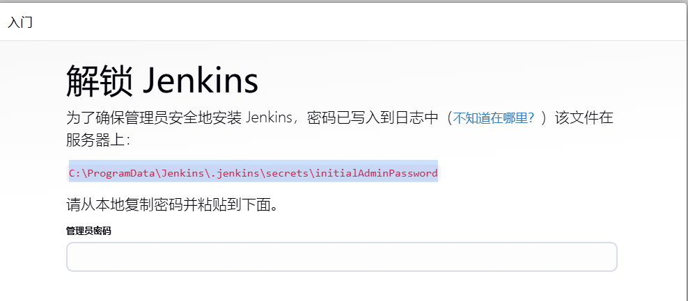
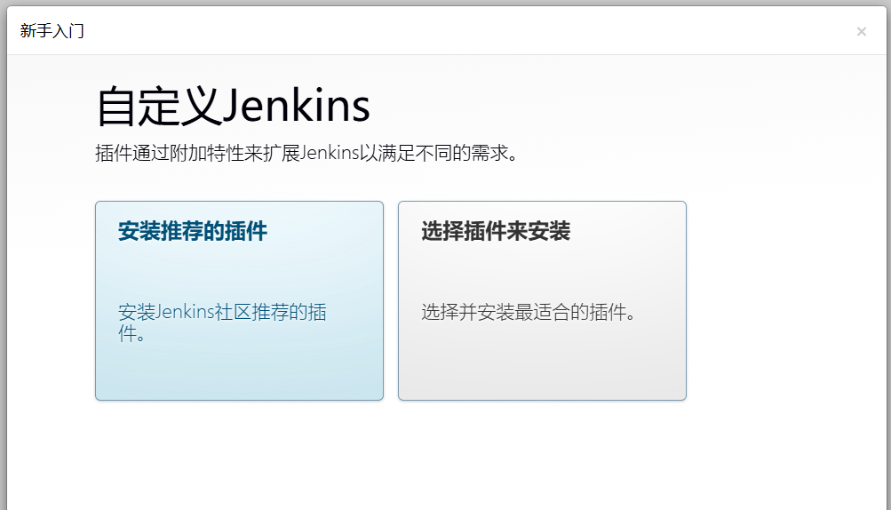
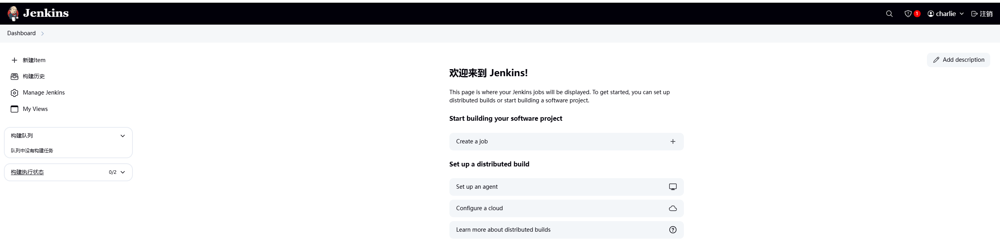
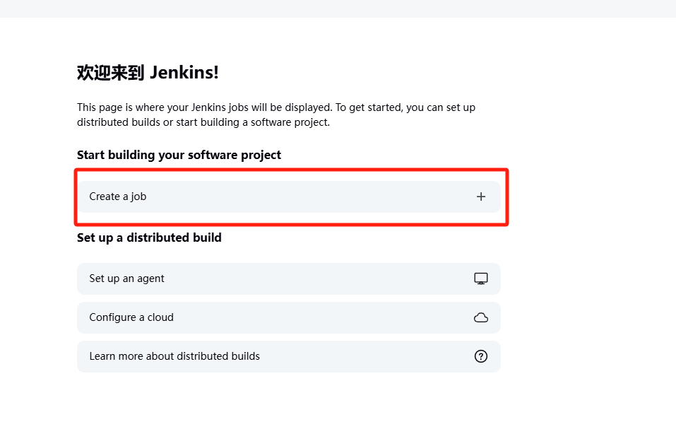
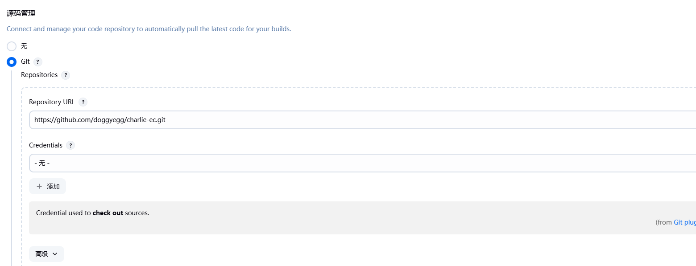

# Jenkins 入门指南：前端自动化部署实践

## Jenkins 简介

Jenkins 是一个开源的自动化服务器，是目前最流行的 CI/CD（持续集成/持续部署）工具之一。它可以自动化各种任务，包括构建、测试和部署软件项目。

### Jenkins 的主要作用

1. **持续集成（CI）**
   - 自动拉取代码
   - 自动执行构建
   - 自动运行测试
   - 生成构建报告

2. **持续部署（CD）**
   - 自动部署到测试环境
   - 自动部署到生产环境
   - 版本控制和回滚
   - 部署状态监控

### Jenkins 的优势

1. **开源免费**
   - 社区活跃
   - 插件丰富
   - 免费使用

2. **高度可定制**
   - 支持多种插件
   - 可以自定义构建流程
   - 灵活的配置选项

3. **跨平台支持**
   - 支持多种操作系统
   - 支持多种构建工具
   - 支持多种版本控制系统

4. **分布式构建能力**
   - 支持主从架构
   - 可以横向扩展
   - 提高构建效率

## 前端项目的 Jenkins 部署实践

### 环境准备

1. **基础环境要求**
   ```bash
   - Node.js (建议 v14+)
   - Git
   - Jenkins
   - Nginx（用于部署）
   ```

2. **Jenkins 安装**
   - Windows 用户可以下载 [Jenkins.msi](https://www.jenkins.io/download/) 安装包
     - 首先需要安装JDK17,或者JDK21不然无法安装Jenkins!
     - 安装过程中需要配置下启动端口，然后一直下一步即可
   - 访问 `http://localhost:8080` 进行初始化配置
   - 
   - 安装推荐的插件包
   - 
    - 新手建议选择推荐即可
  - 创建管理员账号
    - 按照表单自己填写账号密码即可
  - 初始化完成后页面如下
    - 

### Jenkins 配置步骤

1. **创建新任务**
   - 点击 "Create a Job"
    
   - 选择 "Freestyle Project"
   - 输入项目名称

2. **配置源码管理**
   ```yaml
   - 选择 Git
   - 填写仓库 URL
   - 配置凭据（用户名密码或 SSH key）
   - 选择需要构建的分支（如 */master）
   ```
   

3. **构建触发器设置**
   ```yaml
   - 代码提交触发（Poll SCM）
   - 定时构建（如每天晚上）
   - Webhook 触发（需要配置 GitHub/GitLab webhook）
   ```

   **GitHub Webhook 配置：**
   ```yaml
   1. 在 Jenkins 系统配置中：
      - 进入 Jenkins 首页 -> Manage Jenkins -> System
      - 找到 "GitHub" 部分
      - 点击 "Add GitHub Server"
      - Name: 给服务器起个名字（如 github-server）
      - API URL: 默认为 https://api.github.com
      - 凭据：点击 "Add" -> "Jenkins"
        - 类型选择 "Secret text"
        - Secret：填入 GitHub 的 Personal Access Token（在 GitHub Settings -> Developer settings -> Personal access tokens 中生成）
        - ID：给凭据起个名字（如 github-token）
      - 点击 "Test connection" 验证配置
      - 保存配置

   2. 在 GitHub 仓库设置中：
      - 进入 Settings -> Webhooks
      - 点击 "Add webhook"
      - Payload URL：填入 Jenkins 回调 URL
      - Content type：选择 application/json
      - 选择触发事件（通常选择 Push 事件）
      - 保存配置
   ```

   **GitLab Webhook 配置：**
   ```yaml
   1. 在 Jenkins 系统配置中：
      - 确保已安装 GitLab 插件
      - 配置 GitLab Server
      - 生成 API token
      - 记录 Jenkins 的回调 URL：http://your-jenkins-url/project/your-project

   2. 在 GitLab 仓库设置中：
      - 进入 Settings -> Webhooks
      - URL：填入 Jenkins 回调 URL
      - Secret Token：填入 Jenkins 生成的 Token
      - 选择触发事件（通常选择 Push events）
      - 保存配置
   ```

   > 注意：确保 Jenkins 服务器可以被 GitHub/GitLab 访问到，如果是内网环境需要配置相应的网络访问策略。

4. **构建环境配置**
   ```yaml
   - 选择 Node.js 环境
   - 配置 npm registry（如需要）
   - 设置环境变量
   ```

5. **构建步骤**
   ```bash
   # 安装依赖
   npm install

   # 构建项目
   npm run build

   # 部署到服务器
   # 可以使用 rsync 或其他部署方式
   rsync -avz --delete ./dist/ /var/www/html/
   ```

### Jenkins 凭据配置指南

Jenkins 凭据是用于存储敏感信息（如密码、API密钥、SSH密钥等）的安全方式。以下是配置凭据的详细步骤：

1. **访问凭据配置**
   - 点击左侧菜单 "Manage Jenkins"
   - 找到 "Credentials" 选项并点击
   - 点击 "(global)" 域
   - 点击左侧的 "Add Credentials"

2. **凭据类型选择**
   Jenkins 支持多种凭据类型：
   - **Username with password**: 用于用户名和密码认证
   - **SSH Username with private key**: 用于SSH密钥认证
   - **Secret text**: 用于API令牌等单一密钥
   - **Secret file**: 用于需要完整文件的认证
   - **Certificate**: 用于证书认证

3. **配置用户名密码凭据**
   - Kind: 选择 "Username with password"
   - Scope: 通常选择 "Global"
   - Username: 输入Git仓库用户名
   - Password: 输入密码或访问令牌
   - ID: 可选，用于在Jenkins中引用该凭据的唯一标识符
   - Description: 添加描述信息，方便识别用途

4. **配置SSH密钥凭据**
   - Kind: 选择 "SSH Username with private key"
   - Scope: 选择 "Global"
   - ID: 可选，设置唯一标识符
   - Username: 通常是 git
   - Private Key: 选择 "Enter directly" 并粘贴私钥内容
   - Passphrase: 如果私钥有密码，在此输入

5. **在项目中使用凭据**
   - 在项目配置的 "Source Code Management" 部分
   - 选择 Git 并输入仓库 URL
   - 在 Credentials 下拉菜单中选择已配置的凭据
   - 

6. **安全建议**
   - 使用访问令牌替代密码
   - 定期轮换凭据
   - 给予最小必要权限
   - 使用有意义的描述，方便管理
   - 不同项目使用不同凭据，避免权限扩散

### 完整的部署脚本示例

```bash
#!/bin/bash

# 安装依赖
npm install

# 运行测试（如果有）
npm run test

# 构建项目
npm run build

# 备份当前版本
cp -r /var/www/html/current /var/www/html/backup/$(date +%Y%m%d_%H%M%S)

# 部署新版本
rm -rf /var/www/html/current/*
cp -r ./dist/* /var/www/html/current/

# 清理备份（保留最近5个版本）
cd /var/www/html/backup/ && ls -t | tail -n +6 | xargs rm -rf
```

### 常见问题与解决方案

1. **构建失败**
   - 检查 Node.js 版本
   - 检查依赖完整性
   - 查看构建日志

2. **部署失败**
   - 检查服务器权限
   - 确认网络连接
   - 验证部署路径

3. **自动触发失败**
   - 检查 webhook 配置
   - 确认 Jenkins 权限
   - 验证触发器设置

## 最佳实践建议

1. **版本控制**
   - 使用语义化版本
   - 保留部署历史
   - 实现快速回滚

2. **环境管理**
   - 区分开发/测试/生产环境
   - 使用环境变量
   - 做好配置隔离

3. **监控告警**
   - 配置构建通知
   - 设置部署通知
   - 监控系统状态

## 总结

Jenkins 为前端项目提供了强大的自动化部署能力，通过合理的配置和使用，可以显著提高开发团队的效率。本文介绍的配置和步骤可以作为入门参考，读者可以根据实际项目需求进行调整和优化。

## 参考资源

- [Jenkins 官方文档](https://www.jenkins.io/doc/)
- [Jenkins 插件中心](https://plugins.jenkins.io/)
- [Node.js 官方文档](https://nodejs.org/)
